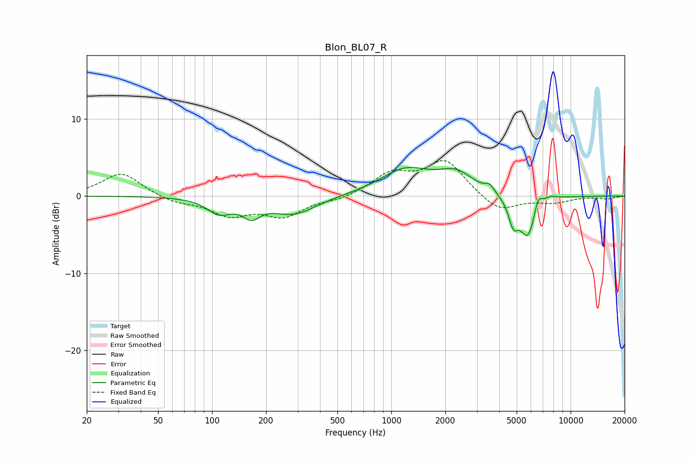

# Blon_BL07_R
See [usage instructions](https://github.com/jaakkopasanen/AutoEq#usage) for more options and info.

### Parametric EQs
Apply preamp of -3.8 dB when using parametric equalizer.

|   # | Type    |   Fc (Hz) |    Q |   Gain (dB) |
|-----|---------|-----------|------|-------------|
|   1 | Peaking |       110 | 2.11 |        -1.9 |
|   2 | Peaking |       166 | 2.86 |        -1.9 |
|   3 | Peaking |       286 | 1.14 |        -2.3 |
|   4 | Peaking |      1198 | 1.01 |         3.3 |
|   5 | Peaking |      2302 | 1.43 |         2.5 |
|   6 | Peaking |      3540 | 5.76 |         0.9 |
|   7 | Peaking |      4789 | 5.33 |        -3   |
|   8 | Peaking |      5778 | 2.96 |        -5.5 |
|   9 | Peaking |      6574 | 5.87 |         2.1 |
|  10 | Peaking |      7657 | 3.46 |         0.6 |

### Fixed Band EQs
When using fixed band (also called graphic) equalizer, apply preamp of **-4.7 dB** (if available) and set gains manually with these parameters.

|   # | Type    |   Fc (Hz) |    Q |   Gain (dB) |
|-----|---------|-----------|------|-------------|
|   1 | Peaking |        31 | 1.41 |         3.1 |
|   2 | Peaking |        62 | 1.41 |        -0.8 |
|   3 | Peaking |       125 | 1.41 |        -2.3 |
|   4 | Peaking |       250 | 1.41 |        -2.5 |
|   5 | Peaking |       500 | 1.41 |        -0.5 |
|   6 | Peaking |      1000 | 1.41 |         2.7 |
|   7 | Peaking |      2000 | 1.41 |         4.5 |
|   8 | Peaking |      4000 | 1.41 |        -2.2 |
|   9 | Peaking |      8000 | 1.41 |        -0.8 |
|  10 | Peaking |     16000 | 1.41 |        -0.3 |

### Graphs

