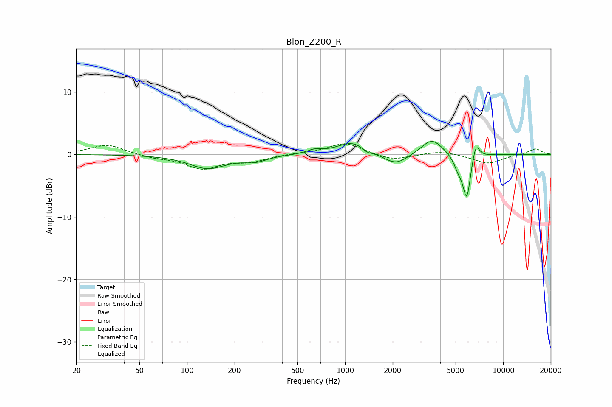

# Blon_Z200_R
See [usage instructions](https://github.com/jaakkopasanen/AutoEq#usage) for more options and info.

### Parametric EQs
Apply preamp of -2.2 dB when using parametric equalizer.

|   # | Type    |   Fc (Hz) |    Q |   Gain (dB) |
|-----|---------|-----------|------|-------------|
|   1 | Peaking |       135 | 1.22 |        -2.2 |
|   2 | Peaking |       270 | 1.95 |        -0.8 |
|   3 | Peaking |       641 | 3.15 |         0.6 |
|   4 | Peaking |      1119 | 1.49 |         2.1 |
|   5 | Peaking |      1376 | 4.41 |        -0.6 |
|   6 | Peaking |      2084 | 1.8  |        -1.9 |
|   7 | Peaking |      3541 | 2.11 |         2.6 |
|   8 | Peaking |      5208 | 4.69 |        -1.9 |
|   9 | Peaking |      5887 | 5.63 |        -7   |
|  10 | Peaking |      6717 | 6    |         2.8 |

### Fixed Band EQs
When using fixed band (also called graphic) equalizer, apply preamp of **-1.8 dB** (if available) and set gains manually with these parameters.

|   # | Type    |   Fc (Hz) |    Q |   Gain (dB) |
|-----|---------|-----------|------|-------------|
|   1 | Peaking |        31 | 1.41 |         1.6 |
|   2 | Peaking |        62 | 1.41 |        -0.5 |
|   3 | Peaking |       125 | 1.41 |        -2.2 |
|   4 | Peaking |       250 | 1.41 |        -1   |
|   5 | Peaking |       500 | 1.41 |         0.1 |
|   6 | Peaking |      1000 | 1.41 |         1.9 |
|   7 | Peaking |      2000 | 1.41 |        -1   |
|   8 | Peaking |      4000 | 1.41 |         0.6 |
|   9 | Peaking |      8000 | 1.41 |        -1.5 |
|  10 | Peaking |     16000 | 1.41 |         1   |

### Graphs

