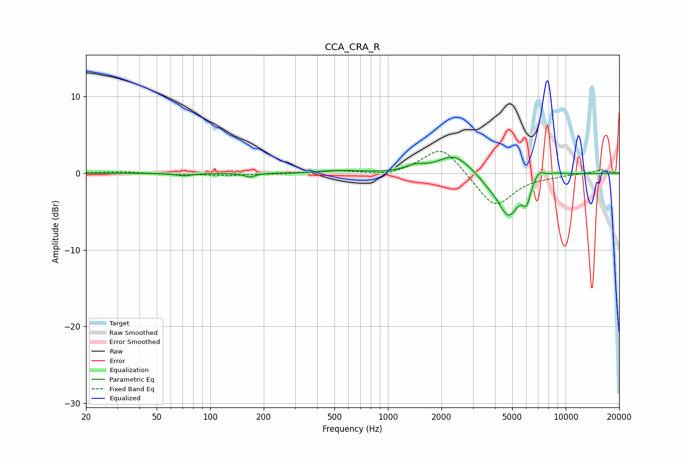

# CCA_CRA_R
See [usage instructions](https://github.com/jaakkopasanen/AutoEq#usage) for more options and info.

### Parametric EQs
Apply preamp of -2.2 dB when using parametric equalizer.

|   # | Type    |   Fc (Hz) |    Q |   Gain (dB) |
|-----|---------|-----------|------|-------------|
|   1 | Peaking |        71 | 3.21 |        -0.3 |
|   2 | Peaking |       167 | 4.9  |        -0.5 |
|   3 | Peaking |       550 | 1.48 |         0.3 |
|   4 | Peaking |      1427 | 2.76 |         0.7 |
|   5 | Peaking |      2363 | 1.55 |         2.5 |
|   6 | Peaking |      3640 | 2.52 |        -0.7 |
|   7 | Peaking |      4762 | 2.26 |        -5.5 |
|   8 | Peaking |      6026 | 6    |        -2.5 |
|   9 | Peaking |      7059 | 4.27 |         1.2 |
|  10 | Peaking |      8859 | 2.77 |         0.3 |

### Fixed Band EQs
When using fixed band (also called graphic) equalizer, apply preamp of **-2.9 dB** (if available) and set gains manually with these parameters.

|   # | Type    |   Fc (Hz) |    Q |   Gain (dB) |
|-----|---------|-----------|------|-------------|
|   1 | Peaking |        31 | 1.41 |         0.2 |
|   2 | Peaking |        62 | 1.41 |        -0.2 |
|   3 | Peaking |       125 | 1.41 |        -0.3 |
|   4 | Peaking |       250 | 1.41 |        -0.1 |
|   5 | Peaking |       500 | 1.41 |         0.4 |
|   6 | Peaking |      1000 | 1.41 |        -0.4 |
|   7 | Peaking |      2000 | 1.41 |         3.7 |
|   8 | Peaking |      4000 | 1.41 |        -4.5 |
|   9 | Peaking |      8000 | 1.41 |        -0.3 |
|  10 | Peaking |     16000 | 1.41 |         0.5 |

### Graphs

