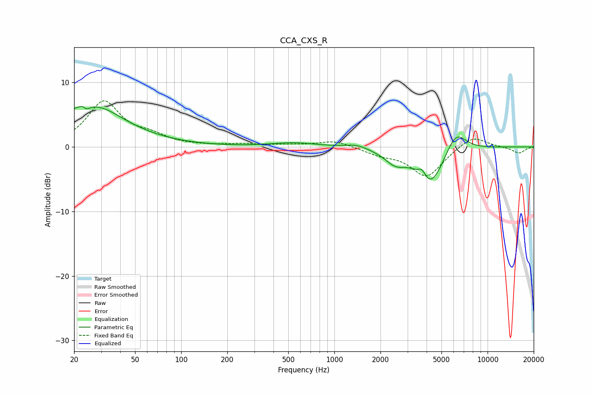

# CCA_CXS_R
See [usage instructions](https://github.com/jaakkopasanen/AutoEq#usage) for more options and info.

### Parametric EQs
Apply preamp of -6.4 dB when using parametric equalizer.

|   # | Type    |   Fc (Hz) |    Q |   Gain (dB) |
|-----|---------|-----------|------|-------------|
|   1 | Peaking |        21 | 0.46 |         5   |
|   2 | Peaking |        23 | 5.76 |         2.3 |
|   3 | Peaking |        24 | 5.91 |        -2.5 |
|   4 | Peaking |        30 | 1.09 |         1.6 |
|   5 | Peaking |       546 | 0.99 |         0.6 |
|   6 | Peaking |      1386 | 2.04 |         0.6 |
|   7 | Peaking |      2500 | 2.01 |        -2   |
|   8 | Peaking |      3729 | 5.96 |         1.3 |
|   9 | Peaking |      4253 | 1.6  |        -5.9 |
|  10 | Peaking |      6192 | 2.06 |         3.5 |

### Fixed Band EQs
When using fixed band (also called graphic) equalizer, apply preamp of **-7.2 dB** (if available) and set gains manually with these parameters.

|   # | Type    |   Fc (Hz) |    Q |   Gain (dB) |
|-----|---------|-----------|------|-------------|
|   1 | Peaking |        31 | 1.41 |         6.9 |
|   2 | Peaking |        62 | 1.41 |         1.4 |
|   3 | Peaking |       125 | 1.41 |         0.1 |
|   4 | Peaking |       250 | 1.41 |         0.4 |
|   5 | Peaking |       500 | 1.41 |         0.3 |
|   6 | Peaking |      1000 | 1.41 |         1   |
|   7 | Peaking |      2000 | 1.41 |        -1   |
|   8 | Peaking |      4000 | 1.41 |        -4.6 |
|   9 | Peaking |      8000 | 1.41 |         1.9 |
|  10 | Peaking |     16000 | 1.41 |        -1   |

### Graphs

