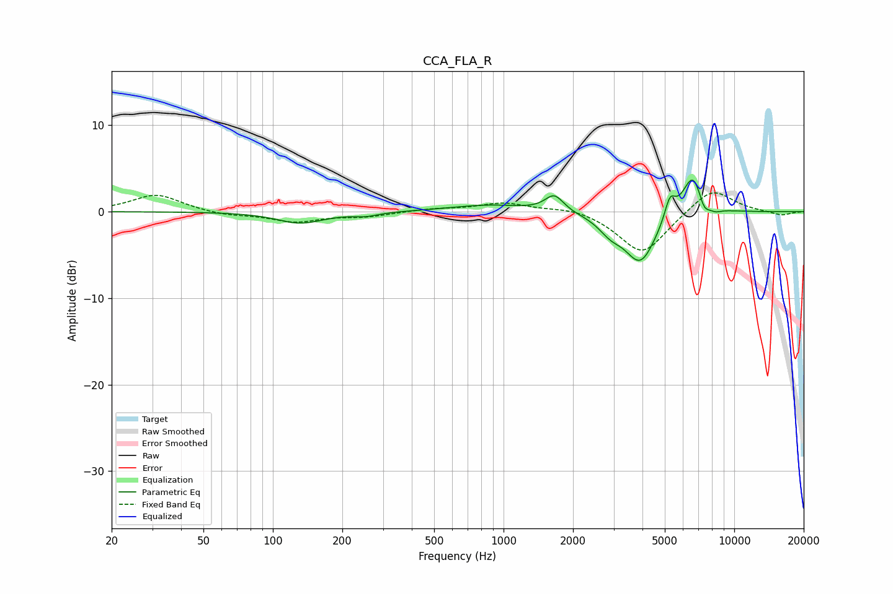

# CCA_FLA_R
See [usage instructions](https://github.com/jaakkopasanen/AutoEq#usage) for more options and info.

### Parametric EQs
Apply preamp of -3.7 dB when using parametric equalizer.

|   # | Type    |   Fc (Hz) |    Q |   Gain (dB) |
|-----|---------|-----------|------|-------------|
|   1 | Peaking |       132 | 1.4  |        -1.3 |
|   2 | Peaking |       253 | 2.58 |        -0.4 |
|   3 | Peaking |       875 | 0.84 |         0.8 |
|   4 | Peaking |      1660 | 3.53 |         1.9 |
|   5 | Peaking |      2908 | 2.74 |        -1.5 |
|   6 | Peaking |      3919 | 2.03 |        -5.8 |
|   7 | Peaking |      5262 | 6    |         2.5 |
|   8 | Peaking |      6635 | 2.95 |         5   |
|   9 | Peaking |      7375 | 5.44 |        -1.8 |
|  10 | Peaking |      8243 | 4.36 |        -0.6 |

### Fixed Band EQs
When using fixed band (also called graphic) equalizer, apply preamp of **-2.3 dB** (if available) and set gains manually with these parameters.

|   # | Type    |   Fc (Hz) |    Q |   Gain (dB) |
|-----|---------|-----------|------|-------------|
|   1 | Peaking |        31 | 1.41 |         2   |
|   2 | Peaking |        62 | 1.41 |        -0.4 |
|   3 | Peaking |       125 | 1.41 |        -1.1 |
|   4 | Peaking |       250 | 1.41 |        -0.5 |
|   5 | Peaking |       500 | 1.41 |         0.3 |
|   6 | Peaking |      1000 | 1.41 |         1   |
|   7 | Peaking |      2000 | 1.41 |         0.6 |
|   8 | Peaking |      4000 | 1.41 |        -5   |
|   9 | Peaking |      8000 | 1.41 |         2.9 |
|  10 | Peaking |     16000 | 1.41 |        -0.5 |

### Graphs

