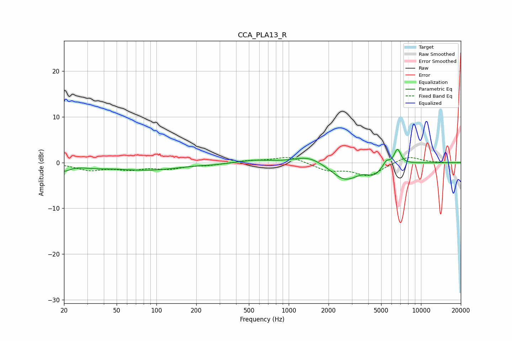

# CCA_PLA13_R
See [usage instructions](https://github.com/jaakkopasanen/AutoEq#usage) for more options and info.

### Parametric EQs
Apply preamp of -3.0 dB when using parametric equalizer.

|   # | Type    |   Fc (Hz) |    Q |   Gain (dB) |
|-----|---------|-----------|------|-------------|
|   1 | Peaking |        20 | 3.15 |        -1.4 |
|   2 | Peaking |        34 | 1.38 |        -0.5 |
|   3 | Peaking |        85 | 0.54 |        -1.6 |
|   4 | Peaking |       271 | 2.72 |        -0.1 |
|   5 | Peaking |       558 | 1.36 |         0.6 |
|   6 | Peaking |      1423 | 1.27 |         1.7 |
|   7 | Peaking |      2659 | 1.34 |        -3.9 |
|   8 | Peaking |      4420 | 2.71 |        -1.8 |
|   9 | Peaking |      5475 | 6    |         1.2 |
|  10 | Peaking |      6638 | 5.38 |         3.3 |

### Fixed Band EQs
When using fixed band (also called graphic) equalizer, apply preamp of **-1.2 dB** (if available) and set gains manually with these parameters.

|   # | Type    |   Fc (Hz) |    Q |   Gain (dB) |
|-----|---------|-----------|------|-------------|
|   1 | Peaking |        31 | 1.41 |        -1.5 |
|   2 | Peaking |        62 | 1.41 |        -1.3 |
|   3 | Peaking |       125 | 1.41 |        -1.2 |
|   4 | Peaking |       250 | 1.41 |        -0.5 |
|   5 | Peaking |       500 | 1.41 |         0.4 |
|   6 | Peaking |      1000 | 1.41 |         1.4 |
|   7 | Peaking |      2000 | 1.41 |        -1.6 |
|   8 | Peaking |      4000 | 1.41 |        -2.8 |
|   9 | Peaking |      8000 | 1.41 |         1.5 |
|  10 | Peaking |     16000 | 1.41 |        -0.1 |

### Graphs

