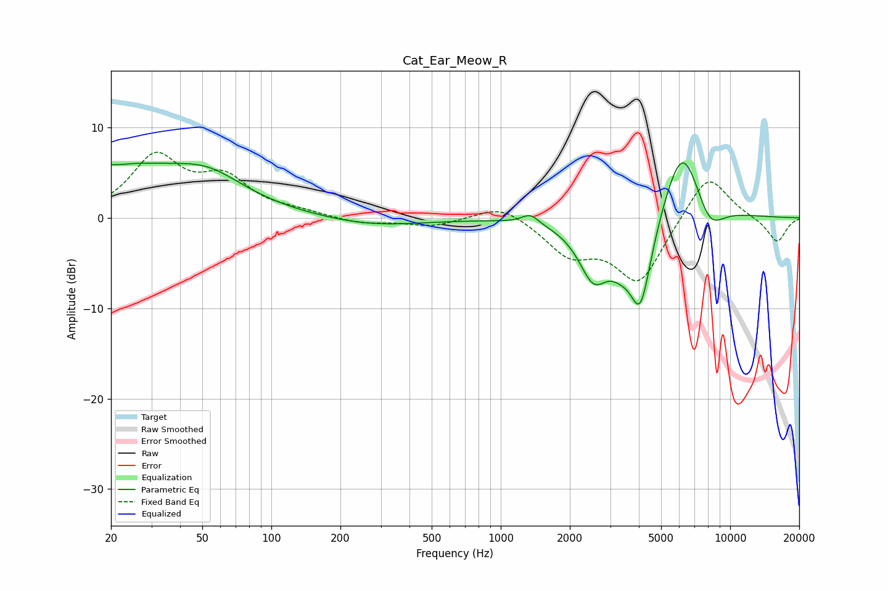

# Cat_Ear_Meow_R
See [usage instructions](https://github.com/jaakkopasanen/AutoEq#usage) for more options and info.

### Parametric EQs
Apply preamp of -6.2 dB when using parametric equalizer.

|   # | Type    |   Fc (Hz) |    Q |   Gain (dB) |
|-----|---------|-----------|------|-------------|
|   1 | Peaking |        20 | 0.34 |         5.6 |
|   2 | Peaking |        22 | 4.22 |        -0.1 |
|   3 | Peaking |        53 | 0.98 |         2.2 |
|   4 | Peaking |       276 | 0.64 |        -0.9 |
|   5 | Peaking |      1345 | 3.79 |         1.1 |
|   6 | Peaking |      2542 | 2.09 |        -6.1 |
|   7 | Peaking |      3308 | 2.78 |        -1.8 |
|   8 | Peaking |      4065 | 2.64 |       -10.3 |
|   9 | Peaking |      6192 | 1.54 |         9.4 |
|  10 | Peaking |      8103 | 2.04 |        -3.7 |

### Fixed Band EQs
When using fixed band (also called graphic) equalizer, apply preamp of **-7.4 dB** (if available) and set gains manually with these parameters.

|   # | Type    |   Fc (Hz) |    Q |   Gain (dB) |
|-----|---------|-----------|------|-------------|
|   1 | Peaking |        31 | 1.41 |         6.5 |
|   2 | Peaking |        62 | 1.41 |         3.9 |
|   3 | Peaking |       125 | 1.41 |         0.5 |
|   4 | Peaking |       250 | 1.41 |        -0.7 |
|   5 | Peaking |       500 | 1.41 |        -0.9 |
|   6 | Peaking |      1000 | 1.41 |         1.7 |
|   7 | Peaking |      2000 | 1.41 |        -3.7 |
|   8 | Peaking |      4000 | 1.41 |        -7.1 |
|   9 | Peaking |      8000 | 1.41 |         5.2 |
|  10 | Peaking |     16000 | 1.41 |        -2.7 |

### Graphs

