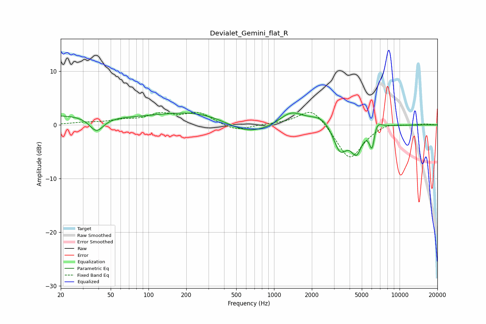

# Devialet_Gemini_flat_R
See [usage instructions](https://github.com/jaakkopasanen/AutoEq#usage) for more options and info.

### Parametric EQs
Apply preamp of -2.3 dB when using parametric equalizer.

|   # | Type    |   Fc (Hz) |    Q |   Gain (dB) |
|-----|---------|-----------|------|-------------|
|   1 | Peaking |        39 | 2.53 |        -2.8 |
|   2 | Peaking |        69 | 0.32 |        -4.3 |
|   3 | Peaking |        83 | 0.18 |         6.1 |
|   4 | Peaking |       606 | 0.74 |        -2.9 |
|   5 | Peaking |      1365 | 1.52 |         2.5 |
|   6 | Peaking |      2413 | 1.46 |         2   |
|   7 | Peaking |      3353 | 2.48 |        -5.2 |
|   8 | Peaking |      4531 | 3.18 |        -4.6 |
|   9 | Peaking |      6050 | 6    |        -5.2 |
|  10 | Peaking |      6413 | 3.71 |         2.6 |

### Fixed Band EQs
When using fixed band (also called graphic) equalizer, apply preamp of **-2.4 dB** (if available) and set gains manually with these parameters.

|   # | Type    |   Fc (Hz) |    Q |   Gain (dB) |
|-----|---------|-----------|------|-------------|
|   1 | Peaking |        31 | 1.41 |         0.4 |
|   2 | Peaking |        62 | 1.41 |         0.7 |
|   3 | Peaking |       125 | 1.41 |         1.8 |
|   4 | Peaking |       250 | 1.41 |         2.1 |
|   5 | Peaking |       500 | 1.41 |        -1.2 |
|   6 | Peaking |      1000 | 1.41 |         0.1 |
|   7 | Peaking |      2000 | 1.41 |         3.4 |
|   8 | Peaking |      4000 | 1.41 |        -6.6 |
|   9 | Peaking |      8000 | 1.41 |         0.7 |
|  10 | Peaking |     16000 | 1.41 |         0.2 |

### Graphs

