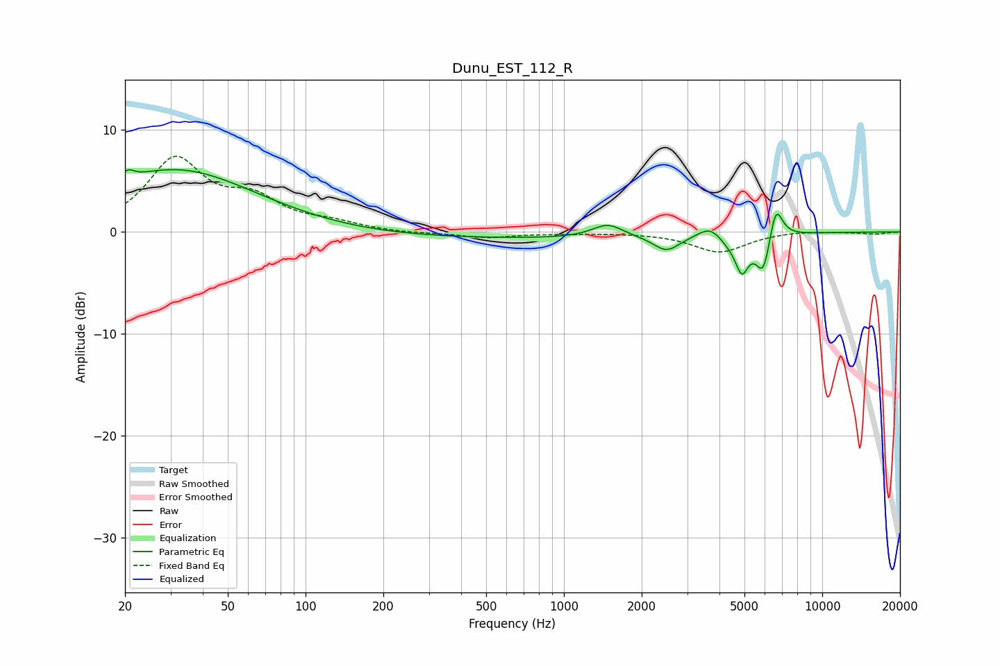

# Dunu_EST_112_R
See [usage instructions](https://github.com/jaakkopasanen/AutoEq#usage) for more options and info.

### Parametric EQs
Apply preamp of -6.2 dB when using parametric equalizer.

|   # | Type    |   Fc (Hz) |    Q |   Gain (dB) |
|-----|---------|-----------|------|-------------|
|   1 | Peaking |        20 | 5.94 |         0.9 |
|   2 | Peaking |        31 | 0.46 |         6.1 |
|   3 | Peaking |       634 | 0.19 |        -0.7 |
|   4 | Peaking |      1478 | 2.34 |         1.3 |
|   5 | Peaking |      2496 | 2.81 |        -1.5 |
|   6 | Peaking |      3693 | 2.97 |         1.3 |
|   7 | Peaking |      4512 | 2.37 |        -1.1 |
|   8 | Peaking |      4892 | 5.82 |        -2.8 |
|   9 | Peaking |      5924 | 4.74 |        -4   |
|  10 | Peaking |      6600 | 5.17 |         3.7 |

### Fixed Band EQs
When using fixed band (also called graphic) equalizer, apply preamp of **-7.5 dB** (if available) and set gains manually with these parameters.

|   # | Type    |   Fc (Hz) |    Q |   Gain (dB) |
|-----|---------|-----------|------|-------------|
|   1 | Peaking |        31 | 1.41 |         6.9 |
|   2 | Peaking |        62 | 1.41 |         2.7 |
|   3 | Peaking |       125 | 1.41 |         0.7 |
|   4 | Peaking |       250 | 1.41 |        -0.2 |
|   5 | Peaking |       500 | 1.41 |        -0.5 |
|   6 | Peaking |      1000 | 1.41 |        -0.1 |
|   7 | Peaking |      2000 | 1.41 |        -0   |
|   8 | Peaking |      4000 | 1.41 |        -2   |
|   9 | Peaking |      8000 | 1.41 |         0.2 |
|  10 | Peaking |     16000 | 1.41 |        -0.2 |

### Graphs

