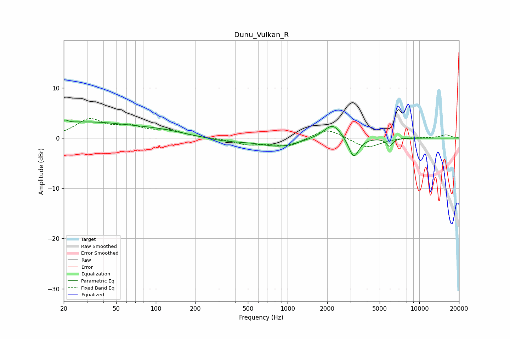

# Dunu_Vulkan_R
See [usage instructions](https://github.com/jaakkopasanen/AutoEq#usage) for more options and info.

### Parametric EQs
Apply preamp of -3.7 dB when using parametric equalizer.

|   # | Type    |   Fc (Hz) |    Q |   Gain (dB) |
|-----|---------|-----------|------|-------------|
|   1 | Peaking |        21 | 5.98 |         3.2 |
|   2 | Peaking |        21 | 6    |        -2.5 |
|   3 | Peaking |        29 | 0.39 |         3   |
|   4 | Peaking |       109 | 0.68 |         0.9 |
|   5 | Peaking |       341 | 0.88 |        -0.7 |
|   6 | Peaking |       876 | 0.95 |        -1.7 |
|   7 | Peaking |      2131 | 1.23 |         0.7 |
|   8 | Peaking |      2202 | 2.33 |         2.5 |
|   9 | Peaking |      3178 | 3.62 |        -4.3 |
|  10 | Peaking |      5927 | 6    |        -1.6 |

### Fixed Band EQs
When using fixed band (also called graphic) equalizer, apply preamp of **-4.0 dB** (if available) and set gains manually with these parameters.

|   # | Type    |   Fc (Hz) |    Q |   Gain (dB) |
|-----|---------|-----------|------|-------------|
|   1 | Peaking |        31 | 1.41 |         3.5 |
|   2 | Peaking |        62 | 1.41 |         1.9 |
|   3 | Peaking |       125 | 1.41 |         1.3 |
|   4 | Peaking |       250 | 1.41 |        -0   |
|   5 | Peaking |       500 | 1.41 |        -1.2 |
|   6 | Peaking |      1000 | 1.41 |        -1.6 |
|   7 | Peaking |      2000 | 1.41 |         2.1 |
|   8 | Peaking |      4000 | 1.41 |        -2   |
|   9 | Peaking |      8000 | 1.41 |         0.2 |
|  10 | Peaking |     16000 | 1.41 |         0.6 |

### Graphs

