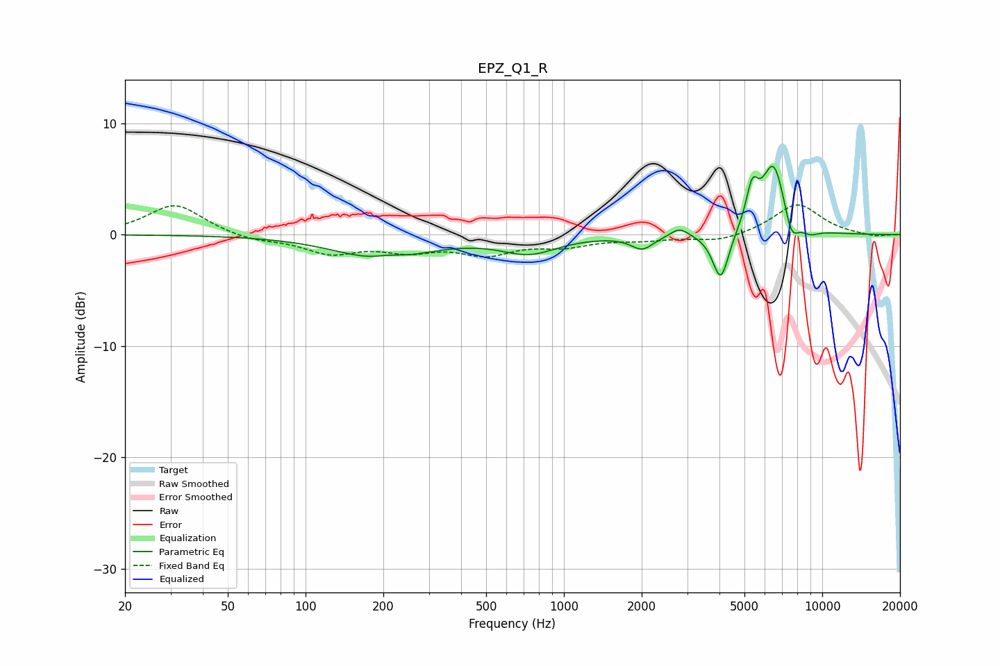

# EPZ_Q1_R
See [usage instructions](https://github.com/jaakkopasanen/AutoEq#usage) for more options and info.

### Parametric EQs
Apply preamp of -6.2 dB when using parametric equalizer.

|   # | Type    |   Fc (Hz) |    Q |   Gain (dB) |
|-----|---------|-----------|------|-------------|
|   1 | Peaking |       198 | 0.81 |        -2.2 |
|   2 | Peaking |       210 | 2.48 |         0.4 |
|   3 | Peaking |       733 | 1.3  |        -1.5 |
|   4 | Peaking |      2012 | 3.3  |        -1.2 |
|   5 | Peaking |      2801 | 4.07 |         0.8 |
|   6 | Peaking |      4048 | 4.44 |        -4.4 |
|   7 | Peaking |      5355 | 5.88 |         3.3 |
|   8 | Peaking |      6484 | 2.91 |         6.4 |
|   9 | Peaking |      7589 | 4.86 |        -2.3 |
|  10 | Peaking |      8973 | 3.61 |        -0.6 |

### Fixed Band EQs
When using fixed band (also called graphic) equalizer, apply preamp of **-2.8 dB** (if available) and set gains manually with these parameters.

|   # | Type    |   Fc (Hz) |    Q |   Gain (dB) |
|-----|---------|-----------|------|-------------|
|   1 | Peaking |        31 | 1.41 |         2.8 |
|   2 | Peaking |        62 | 1.41 |        -0.5 |
|   3 | Peaking |       125 | 1.41 |        -1.5 |
|   4 | Peaking |       250 | 1.41 |        -1.2 |
|   5 | Peaking |       500 | 1.41 |        -1.6 |
|   6 | Peaking |      1000 | 1.41 |        -0.9 |
|   7 | Peaking |      2000 | 1.41 |        -0.4 |
|   8 | Peaking |      4000 | 1.41 |        -0.7 |
|   9 | Peaking |      8000 | 1.41 |         2.8 |
|  10 | Peaking |     16000 | 1.41 |        -0.2 |

### Graphs

