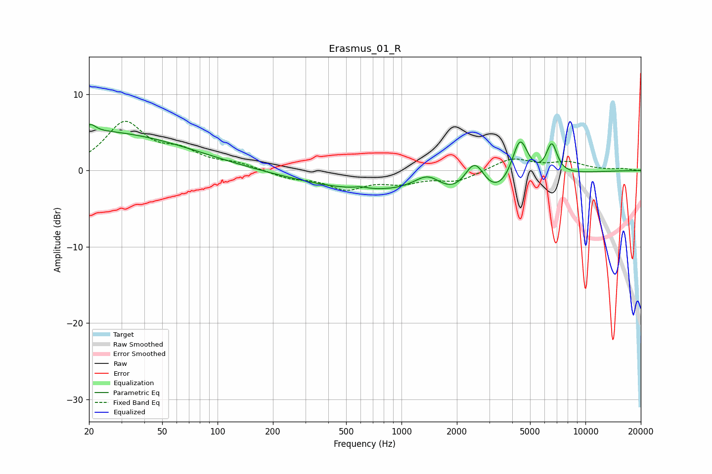

# Erasmus_01_R
See [usage instructions](https://github.com/jaakkopasanen/AutoEq#usage) for more options and info.

### Parametric EQs
Apply preamp of -6.1 dB when using parametric equalizer.

|   # | Type    |   Fc (Hz) |    Q |   Gain (dB) |
|-----|---------|-----------|------|-------------|
|   1 | Peaking |        20 | 0.26 |         5.2 |
|   2 | Peaking |        20 | 5.44 |         0.9 |
|   3 | Peaking |       601 | 4.16 |         0.3 |
|   4 | Peaking |       620 | 0.38 |        -2.3 |
|   5 | Peaking |      1045 | 5.29 |         0   |
|   6 | Peaking |      1392 | 1.84 |         2.4 |
|   7 | Peaking |      2504 | 2.08 |         6.9 |
|   8 | Peaking |      2641 | 0.82 |        -6.4 |
|   9 | Peaking |      4405 | 3.09 |         6.2 |
|  10 | Peaking |      6561 | 4.49 |         4.1 |

### Fixed Band EQs
When using fixed band (also called graphic) equalizer, apply preamp of **-6.6 dB** (if available) and set gains manually with these parameters.

|   # | Type    |   Fc (Hz) |    Q |   Gain (dB) |
|-----|---------|-----------|------|-------------|
|   1 | Peaking |        31 | 1.41 |         6.1 |
|   2 | Peaking |        62 | 1.41 |         2.1 |
|   3 | Peaking |       125 | 1.41 |         0.8 |
|   4 | Peaking |       250 | 1.41 |        -0.9 |
|   5 | Peaking |       500 | 1.41 |        -2.2 |
|   6 | Peaking |      1000 | 1.41 |        -1.3 |
|   7 | Peaking |      2000 | 1.41 |        -1.3 |
|   8 | Peaking |      4000 | 1.41 |         1.6 |
|   9 | Peaking |      8000 | 1.41 |         1   |
|  10 | Peaking |     16000 | 1.41 |         0.2 |

### Graphs

