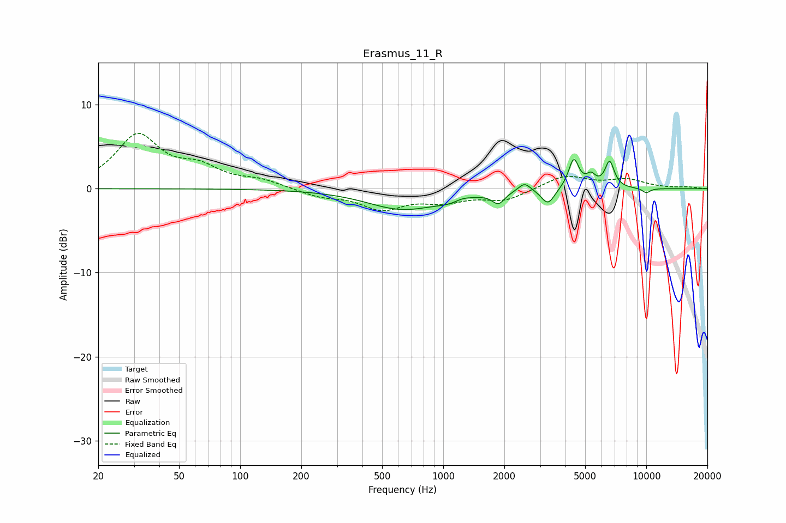

# Erasmus_11_R
See [usage instructions](https://github.com/jaakkopasanen/AutoEq#usage) for more options and info.

### Parametric EQs
Apply preamp of -3.6 dB when using parametric equalizer.

|   # | Type    |   Fc (Hz) |    Q |   Gain (dB) |
|-----|---------|-----------|------|-------------|
|   1 | Peaking |       626 | 0.82 |        -2.4 |
|   2 | Peaking |      1136 | 1.81 |        -0.9 |
|   3 | Peaking |      1232 | 3.01 |         0.6 |
|   4 | Peaking |      1870 | 4.73 |        -1.4 |
|   5 | Peaking |      2514 | 4.63 |         1.1 |
|   6 | Peaking |      3280 | 4.37 |        -1.9 |
|   7 | Peaking |      4393 | 5.5  |         3.5 |
|   8 | Peaking |      5347 | 6    |         1.2 |
|   9 | Peaking |      6600 | 5.99 |         3.1 |
|  10 | Peaking |     10000 | 6    |        -0.6 |

### Fixed Band EQs
When using fixed band (also called graphic) equalizer, apply preamp of **-6.7 dB** (if available) and set gains manually with these parameters.

|   # | Type    |   Fc (Hz) |    Q |   Gain (dB) |
|-----|---------|-----------|------|-------------|
|   1 | Peaking |        31 | 1.41 |         6.2 |
|   2 | Peaking |        62 | 1.41 |         2.1 |
|   3 | Peaking |       125 | 1.41 |         0.9 |
|   4 | Peaking |       250 | 1.41 |        -0.9 |
|   5 | Peaking |       500 | 1.41 |        -2.3 |
|   6 | Peaking |      1000 | 1.41 |        -1.3 |
|   7 | Peaking |      2000 | 1.41 |        -1.3 |
|   8 | Peaking |      4000 | 1.41 |         1.6 |
|   9 | Peaking |      8000 | 1.41 |         1   |
|  10 | Peaking |     16000 | 1.41 |         0.2 |

### Graphs

