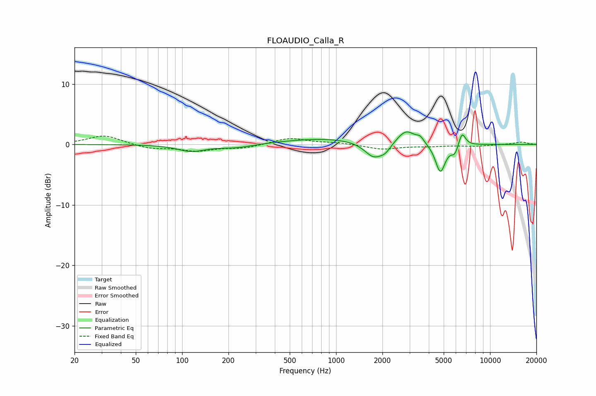

# FLOAUDIO_Calla_R
See [usage instructions](https://github.com/jaakkopasanen/AutoEq#usage) for more options and info.

### Parametric EQs
Apply preamp of -2.2 dB when using parametric equalizer.

|   # | Type    |   Fc (Hz) |    Q |   Gain (dB) |
|-----|---------|-----------|------|-------------|
|   1 | Peaking |       115 | 1.62 |        -1.1 |
|   2 | Peaking |       223 | 1.24 |        -0.6 |
|   3 | Peaking |       859 | 0.51 |         1   |
|   4 | Peaking |      1752 | 2.37 |        -2.5 |
|   5 | Peaking |      2089 | 3.7  |        -1.1 |
|   6 | Peaking |      2852 | 2.38 |         2.4 |
|   7 | Peaking |      3519 | 5.99 |         0.8 |
|   8 | Peaking |      4757 | 4.36 |        -4.8 |
|   9 | Peaking |      5910 | 6    |        -1.5 |
|  10 | Peaking |      6575 | 5.99 |         2.3 |

### Fixed Band EQs
When using fixed band (also called graphic) equalizer, apply preamp of **-1.5 dB** (if available) and set gains manually with these parameters.

|   # | Type    |   Fc (Hz) |    Q |   Gain (dB) |
|-----|---------|-----------|------|-------------|
|   1 | Peaking |        31 | 1.41 |         1.5 |
|   2 | Peaking |        62 | 1.41 |        -0.7 |
|   3 | Peaking |       125 | 1.41 |        -1   |
|   4 | Peaking |       250 | 1.41 |        -0.6 |
|   5 | Peaking |       500 | 1.41 |         1.1 |
|   6 | Peaking |      1000 | 1.41 |         0.3 |
|   7 | Peaking |      2000 | 1.41 |        -0.8 |
|   8 | Peaking |      4000 | 1.41 |        -0.3 |
|   9 | Peaking |      8000 | 1.41 |        -0.3 |
|  10 | Peaking |     16000 | 1.41 |         0.4 |

### Graphs

