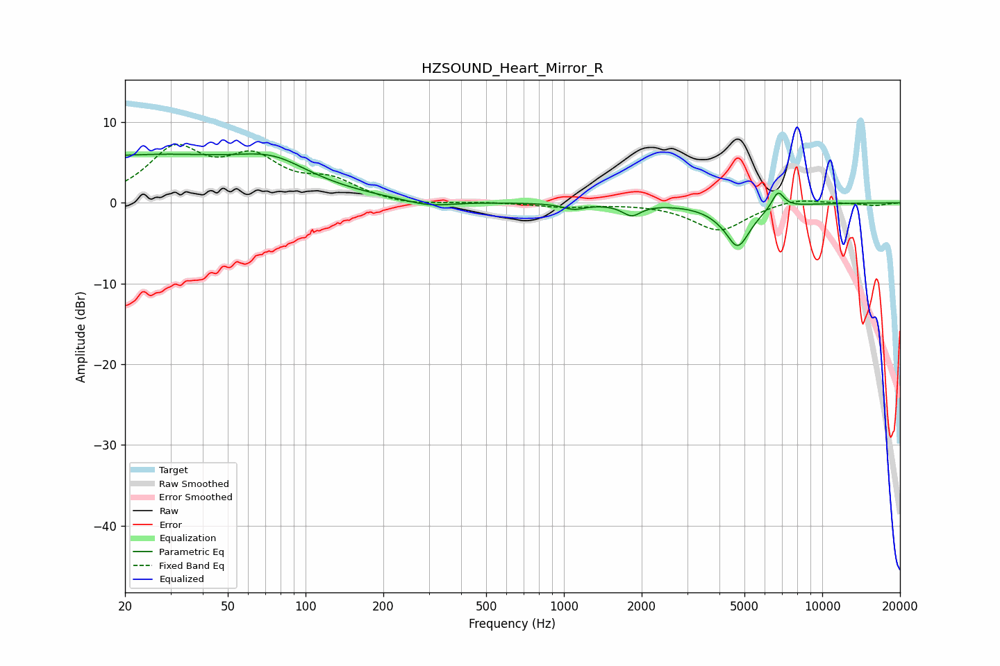

# HZSOUND_Heart_Mirror_R
See [usage instructions](https://github.com/jaakkopasanen/AutoEq#usage) for more options and info.

### Parametric EQs
Apply preamp of -6.2 dB when using parametric equalizer.

|   # | Type    |   Fc (Hz) |    Q |   Gain (dB) |
|-----|---------|-----------|------|-------------|
|   1 | Peaking |        20 | 5.72 |         0.1 |
|   2 | Peaking |        24 | 0.3  |         5.7 |
|   3 | Peaking |        75 | 1.07 |         2.4 |
|   4 | Peaking |       300 | 1.55 |        -0.8 |
|   5 | Peaking |      1093 | 3.28 |        -0.7 |
|   6 | Peaking |      1828 | 3.98 |        -1.4 |
|   7 | Peaking |      4316 | 5.95 |         0.2 |
|   8 | Peaking |      4627 | 1.8  |        -1.5 |
|   9 | Peaking |      4695 | 3.11 |        -3.9 |
|  10 | Peaking |      6740 | 5.68 |         2.2 |

### Fixed Band EQs
When using fixed band (also called graphic) equalizer, apply preamp of **-7.3 dB** (if available) and set gains manually with these parameters.

|   # | Type    |   Fc (Hz) |    Q |   Gain (dB) |
|-----|---------|-----------|------|-------------|
|   1 | Peaking |        31 | 1.41 |         6.2 |
|   2 | Peaking |        62 | 1.41 |         4.8 |
|   3 | Peaking |       125 | 1.41 |         2.4 |
|   4 | Peaking |       250 | 1.41 |        -0.5 |
|   5 | Peaking |       500 | 1.41 |         0.1 |
|   6 | Peaking |      1000 | 1.41 |        -0.5 |
|   7 | Peaking |      2000 | 1.41 |         0   |
|   8 | Peaking |      4000 | 1.41 |        -3.4 |
|   9 | Peaking |      8000 | 1.41 |         0.7 |
|  10 | Peaking |     16000 | 1.41 |        -0.3 |

### Graphs

