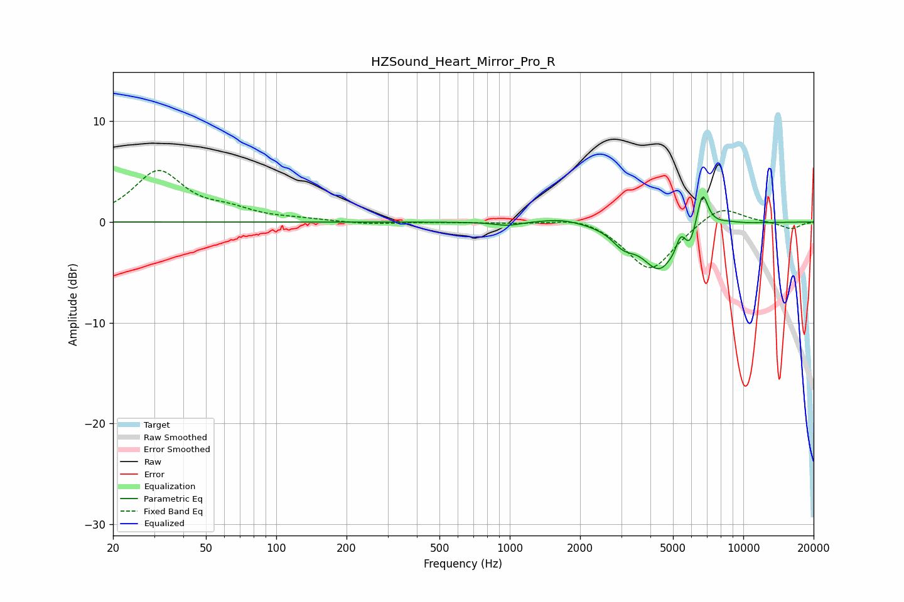

# HZSound_Heart_Mirror_Pro_R
See [usage instructions](https://github.com/jaakkopasanen/AutoEq#usage) for more options and info.

### Parametric EQs
Apply preamp of -2.6 dB when using parametric equalizer.

|   # | Type    |   Fc (Hz) |    Q |   Gain (dB) |
|-----|---------|-----------|------|-------------|
|   1 | Peaking |       976 | 2.68 |        -0.4 |
|   2 | Peaking |      1665 | 1.55 |         0.5 |
|   3 | Peaking |      3066 | 2.86 |        -1.4 |
|   4 | Peaking |      4382 | 1.84 |        -4.6 |
|   5 | Peaking |      5147 | 6    |        -0.6 |
|   6 | Peaking |      5358 | 6    |         1.9 |
|   7 | Peaking |      5907 | 6    |        -1.6 |
|   8 | Peaking |      6684 | 5.92 |         3.3 |
|   9 | Peaking |      6745 | 3.24 |         0.6 |
|  10 | Peaking |      8467 | 2.33 |         0.2 |

### Fixed Band EQs
When using fixed band (also called graphic) equalizer, apply preamp of **-5.2 dB** (if available) and set gains manually with these parameters.

|   # | Type    |   Fc (Hz) |    Q |   Gain (dB) |
|-----|---------|-----------|------|-------------|
|   1 | Peaking |        31 | 1.41 |         4.9 |
|   2 | Peaking |        62 | 1.41 |         0.9 |
|   3 | Peaking |       125 | 1.41 |         0.2 |
|   4 | Peaking |       250 | 1.41 |        -0.2 |
|   5 | Peaking |       500 | 1.41 |        -0   |
|   6 | Peaking |      1000 | 1.41 |        -0.1 |
|   7 | Peaking |      2000 | 1.41 |         0.7 |
|   8 | Peaking |      4000 | 1.41 |        -4.9 |
|   9 | Peaking |      8000 | 1.41 |         1.8 |
|  10 | Peaking |     16000 | 1.41 |        -0.7 |

### Graphs

