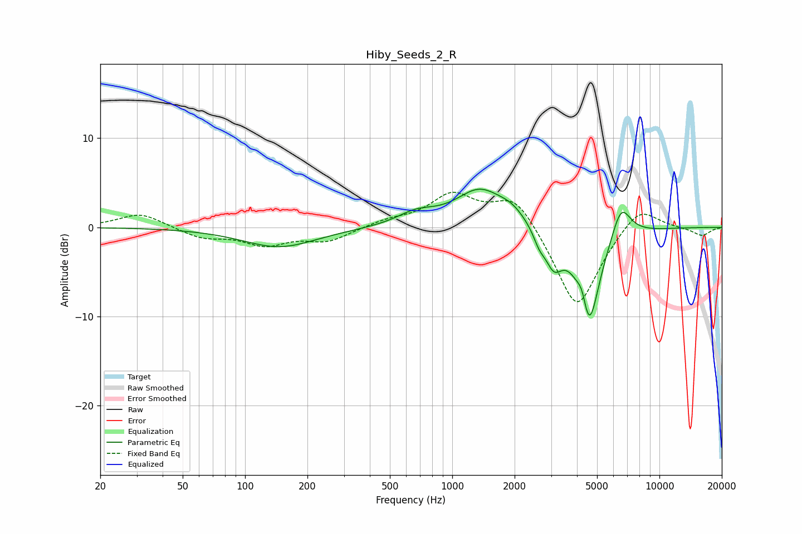

# Hiby_Seeds_2_R
See [usage instructions](https://github.com/jaakkopasanen/AutoEq#usage) for more options and info.

### Parametric EQs
Apply preamp of -4.4 dB when using parametric equalizer.

|   # | Type    |   Fc (Hz) |    Q |   Gain (dB) |
|-----|---------|-----------|------|-------------|
|   1 | Peaking |       146 | 0.79 |        -2.2 |
|   2 | Peaking |       670 | 1.51 |         1.3 |
|   3 | Peaking |      1358 | 1.21 |         4.1 |
|   4 | Peaking |      1951 | 2.09 |         1.2 |
|   5 | Peaking |      2632 | 4.94 |        -1.3 |
|   6 | Peaking |      3089 | 3.39 |        -3.5 |
|   7 | Peaking |      4251 | 5.93 |         2.3 |
|   8 | Peaking |      4551 | 2.6  |       -11.6 |
|   9 | Peaking |      6528 | 2.97 |         3.8 |
|  10 | Peaking |      9848 | 2.37 |        -0   |

### Fixed Band EQs
When using fixed band (also called graphic) equalizer, apply preamp of **-4.0 dB** (if available) and set gains manually with these parameters.

|   # | Type    |   Fc (Hz) |    Q |   Gain (dB) |
|-----|---------|-----------|------|-------------|
|   1 | Peaking |        31 | 1.41 |         1.6 |
|   2 | Peaking |        62 | 1.41 |        -1.1 |
|   3 | Peaking |       125 | 1.41 |        -1.8 |
|   4 | Peaking |       250 | 1.41 |        -1.5 |
|   5 | Peaking |       500 | 1.41 |         0.7 |
|   6 | Peaking |      1000 | 1.41 |         3.5 |
|   7 | Peaking |      2000 | 1.41 |         3.8 |
|   8 | Peaking |      4000 | 1.41 |        -9.5 |
|   9 | Peaking |      8000 | 1.41 |         2.8 |
|  10 | Peaking |     16000 | 1.41 |        -0.9 |

### Graphs

