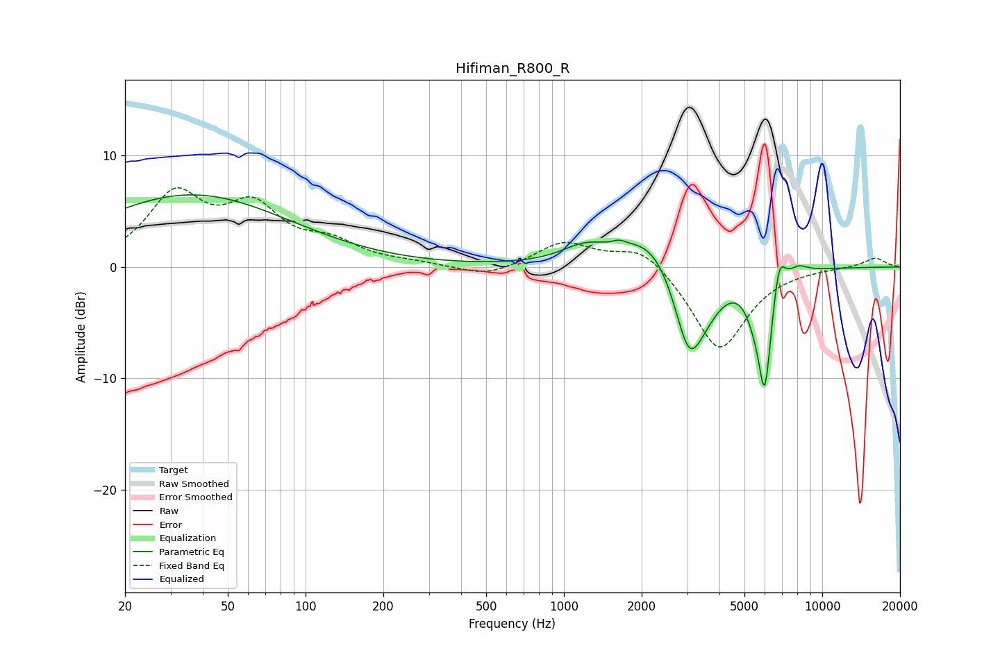

# Hifiman_R800_R
See [usage instructions](https://github.com/jaakkopasanen/AutoEq#usage) for more options and info.

### Parametric EQs
Apply preamp of -6.6 dB when using parametric equalizer.

|   # | Type    |   Fc (Hz) |    Q |   Gain (dB) |
|-----|---------|-----------|------|-------------|
|   1 | Peaking |        36 | 0.37 |         6.5 |
|   2 | Peaking |      1206 | 1.54 |         1.5 |
|   3 | Peaking |      1634 | 5.81 |         0.4 |
|   4 | Peaking |      2204 | 1.17 |         3.3 |
|   5 | Peaking |      3045 | 2.4  |        -7.6 |
|   6 | Peaking |      3542 | 1.87 |        -2.1 |
|   7 | Peaking |      5390 | 4.06 |        -1.4 |
|   8 | Peaking |      5988 | 5.1  |       -10.3 |
|   9 | Peaking |      6805 | 5.93 |         3.2 |
|  10 | Peaking |      8074 | 3.64 |         0.7 |

### Fixed Band EQs
When using fixed band (also called graphic) equalizer, apply preamp of **-7.2 dB** (if available) and set gains manually with these parameters.

|   # | Type    |   Fc (Hz) |    Q |   Gain (dB) |
|-----|---------|-----------|------|-------------|
|   1 | Peaking |        31 | 1.41 |         6.1 |
|   2 | Peaking |        62 | 1.41 |         4.8 |
|   3 | Peaking |       125 | 1.41 |         1.8 |
|   4 | Peaking |       250 | 1.41 |         0.3 |
|   5 | Peaking |       500 | 1.41 |        -1   |
|   6 | Peaking |      1000 | 1.41 |         2.2 |
|   7 | Peaking |      2000 | 1.41 |         2.1 |
|   8 | Peaking |      4000 | 1.41 |        -7.6 |
|   9 | Peaking |      8000 | 1.41 |        -0   |
|  10 | Peaking |     16000 | 1.41 |         0.9 |

### Graphs

