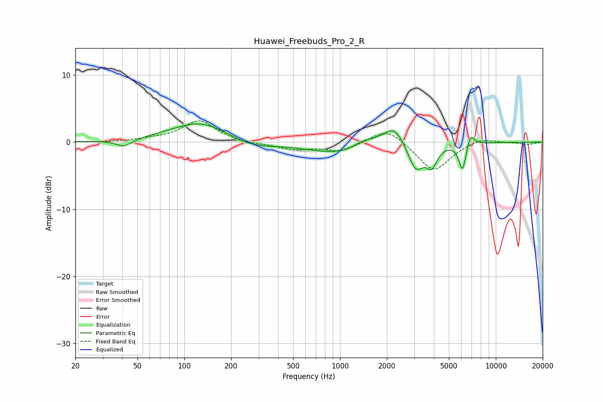

# Huawei_Freebuds_Pro_2_R
See [usage instructions](https://github.com/jaakkopasanen/AutoEq#usage) for more options and info.

### Parametric EQs
Apply preamp of -2.8 dB when using parametric equalizer.

|   # | Type    |   Fc (Hz) |    Q |   Gain (dB) |
|-----|---------|-----------|------|-------------|
|   1 | Peaking |        41 | 2.79 |        -1.1 |
|   2 | Peaking |       130 | 0.73 |         3.3 |
|   3 | Peaking |       256 | 0.89 |        -1.4 |
|   4 | Peaking |       998 | 0.69 |        -1.7 |
|   5 | Peaking |      1425 | 2.04 |         1   |
|   6 | Peaking |      2224 | 1.89 |         3.2 |
|   7 | Peaking |      3063 | 2.64 |        -4.4 |
|   8 | Peaking |      3891 | 4.29 |        -2.7 |
|   9 | Peaking |      6111 | 6    |        -4.1 |
|  10 | Peaking |      6891 | 5.77 |         1.9 |

### Fixed Band EQs
When using fixed band (also called graphic) equalizer, apply preamp of **-3.3 dB** (if available) and set gains manually with these parameters.

|   # | Type    |   Fc (Hz) |    Q |   Gain (dB) |
|-----|---------|-----------|------|-------------|
|   1 | Peaking |        31 | 1.41 |        -0.1 |
|   2 | Peaking |        62 | 1.41 |         0.3 |
|   3 | Peaking |       125 | 1.41 |         3.2 |
|   4 | Peaking |       250 | 1.41 |        -0.3 |
|   5 | Peaking |       500 | 1.41 |        -1   |
|   6 | Peaking |      1000 | 1.41 |        -1.3 |
|   7 | Peaking |      2000 | 1.41 |         2.3 |
|   8 | Peaking |      4000 | 1.41 |        -4.4 |
|   9 | Peaking |      8000 | 1.41 |         0.7 |
|  10 | Peaking |     16000 | 1.41 |        -0.4 |

### Graphs

