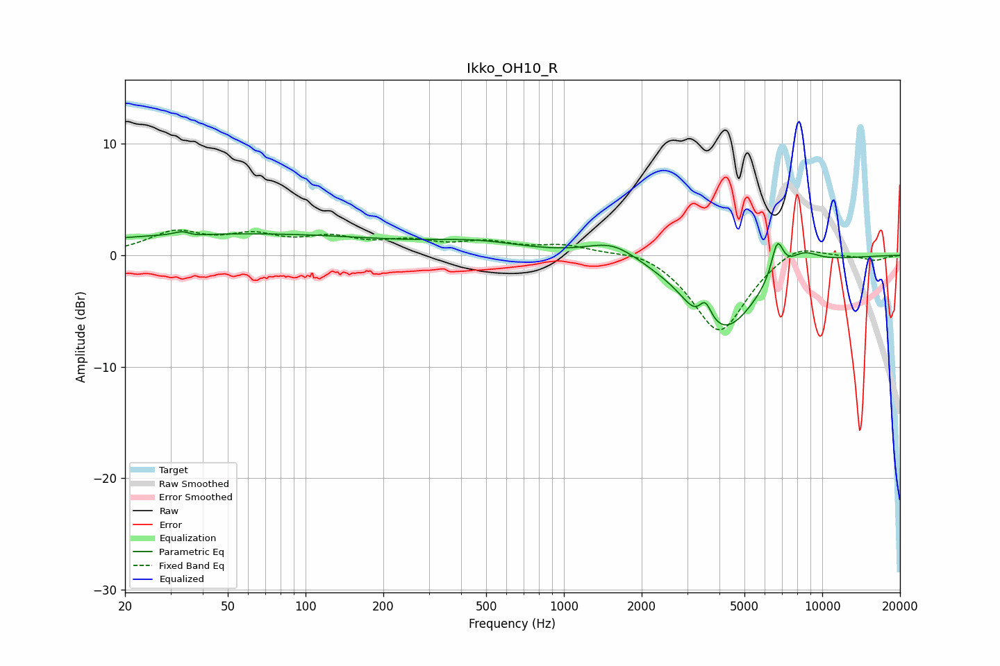

# Ikko_OH10_R
See [usage instructions](https://github.com/jaakkopasanen/AutoEq#usage) for more options and info.

### Parametric EQs
Apply preamp of -2.2 dB when using parametric equalizer.

|   # | Type    |   Fc (Hz) |    Q |   Gain (dB) |
|-----|---------|-----------|------|-------------|
|   1 | Peaking |        34 | 3.62 |         2.1 |
|   2 | Peaking |        34 | 3.35 |        -1.9 |
|   3 | Peaking |        52 | 0.21 |         1.9 |
|   4 | Peaking |       465 | 0.77 |         0.9 |
|   5 | Peaking |      1544 | 1.41 |         1.6 |
|   6 | Peaking |      3199 | 3.27 |        -0.8 |
|   7 | Peaking |      3528 | 6    |         1.8 |
|   8 | Peaking |      4164 | 1.06 |        -6.7 |
|   9 | Peaking |      6698 | 5.81 |         3.2 |
|  10 | Peaking |      8398 | 2.04 |         1.4 |

### Fixed Band EQs
When using fixed band (also called graphic) equalizer, apply preamp of **-2.4 dB** (if available) and set gains manually with these parameters.

|   # | Type    |   Fc (Hz) |    Q |   Gain (dB) |
|-----|---------|-----------|------|-------------|
|   1 | Peaking |        31 | 1.41 |         1.9 |
|   2 | Peaking |        62 | 1.41 |         1.5 |
|   3 | Peaking |       125 | 1.41 |         1.3 |
|   4 | Peaking |       250 | 1.41 |         1   |
|   5 | Peaking |       500 | 1.41 |         1   |
|   6 | Peaking |      1000 | 1.41 |         0.8 |
|   7 | Peaking |      2000 | 1.41 |         0.7 |
|   8 | Peaking |      4000 | 1.41 |        -7   |
|   9 | Peaking |      8000 | 1.41 |         1.3 |
|  10 | Peaking |     16000 | 1.41 |        -0.4 |

### Graphs

