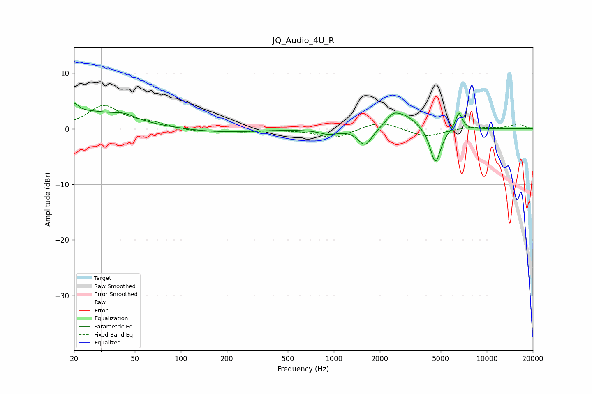

# JQ_Audio_4U_R
See [usage instructions](https://github.com/jaakkopasanen/AutoEq#usage) for more options and info.

### Parametric EQs
Apply preamp of -4.7 dB when using parametric equalizer.

|   # | Type    |   Fc (Hz) |    Q |   Gain (dB) |
|-----|---------|-----------|------|-------------|
|   1 | Peaking |        20 | 5.39 |         1.5 |
|   2 | Peaking |        23 | 0.51 |         3.1 |
|   3 | Peaking |        43 | 2.21 |         0.8 |
|   4 | Peaking |       174 | 0.55 |        -0.7 |
|   5 | Peaking |       927 | 2.34 |        -0.9 |
|   6 | Peaking |      1604 | 3.12 |        -3.2 |
|   7 | Peaking |      2433 | 3.67 |         1.4 |
|   8 | Peaking |      2870 | 1.62 |         2.6 |
|   9 | Peaking |      4617 | 3.99 |        -6.6 |
|  10 | Peaking |      6573 | 6    |         3.2 |

### Fixed Band EQs
When using fixed band (also called graphic) equalizer, apply preamp of **-4.3 dB** (if available) and set gains manually with these parameters.

|   # | Type    |   Fc (Hz) |    Q |   Gain (dB) |
|-----|---------|-----------|------|-------------|
|   1 | Peaking |        31 | 1.41 |         4.1 |
|   2 | Peaking |        62 | 1.41 |         0.9 |
|   3 | Peaking |       125 | 1.41 |        -0.5 |
|   4 | Peaking |       250 | 1.41 |        -0.5 |
|   5 | Peaking |       500 | 1.41 |        -0.1 |
|   6 | Peaking |      1000 | 1.41 |        -1.7 |
|   7 | Peaking |      2000 | 1.41 |         1.4 |
|   8 | Peaking |      4000 | 1.41 |        -1.5 |
|   9 | Peaking |      8000 | 1.41 |         0.4 |
|  10 | Peaking |     16000 | 1.41 |         0.9 |

### Graphs

