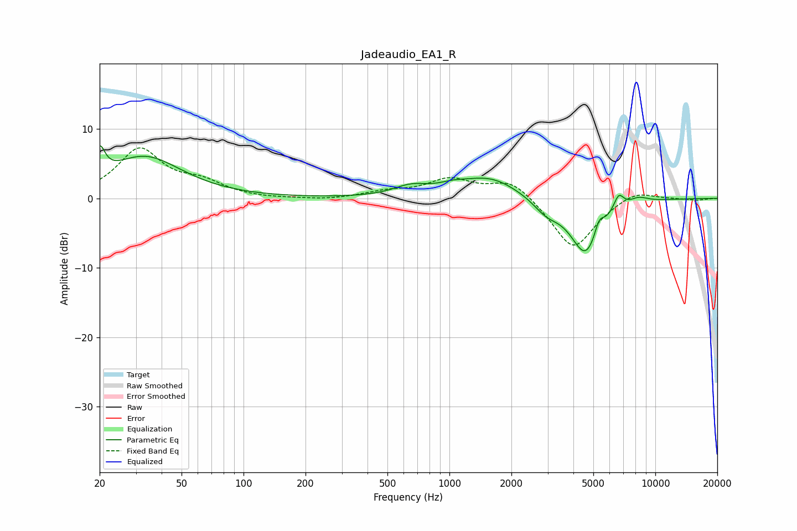

# Jadeaudio_EA1_R
See [usage instructions](https://github.com/jaakkopasanen/AutoEq#usage) for more options and info.

### Parametric EQs
Apply preamp of -7.6 dB when using parametric equalizer.

|   # | Type    |   Fc (Hz) |    Q |   Gain (dB) |
|-----|---------|-----------|------|-------------|
|   1 | Peaking |        20 | 5.6  |         4   |
|   2 | Peaking |        33 | 0.79 |         5.9 |
|   3 | Peaking |       650 | 1.68 |         1.4 |
|   4 | Peaking |      1033 | 2.08 |         0.7 |
|   5 | Peaking |      1573 | 0.99 |         3   |
|   6 | Peaking |      2956 | 2.25 |        -1.8 |
|   7 | Peaking |      4594 | 1.85 |        -8.2 |
|   8 | Peaking |      5334 | 6    |         2.2 |
|   9 | Peaking |      6639 | 5.46 |         2.3 |
|  10 | Peaking |      8288 | 2.83 |         0.9 |

### Fixed Band EQs
When using fixed band (also called graphic) equalizer, apply preamp of **-7.4 dB** (if available) and set gains manually with these parameters.

|   # | Type    |   Fc (Hz) |    Q |   Gain (dB) |
|-----|---------|-----------|------|-------------|
|   1 | Peaking |        31 | 1.41 |         6.9 |
|   2 | Peaking |        62 | 1.41 |         1.9 |
|   3 | Peaking |       125 | 1.41 |        -0.1 |
|   4 | Peaking |       250 | 1.41 |        -0.3 |
|   5 | Peaking |       500 | 1.41 |         0.8 |
|   6 | Peaking |      1000 | 1.41 |         2.6 |
|   7 | Peaking |      2000 | 1.41 |         2.8 |
|   8 | Peaking |      4000 | 1.41 |        -7.5 |
|   9 | Peaking |      8000 | 1.41 |         1.4 |
|  10 | Peaking |     16000 | 1.41 |        -0.3 |

### Graphs

