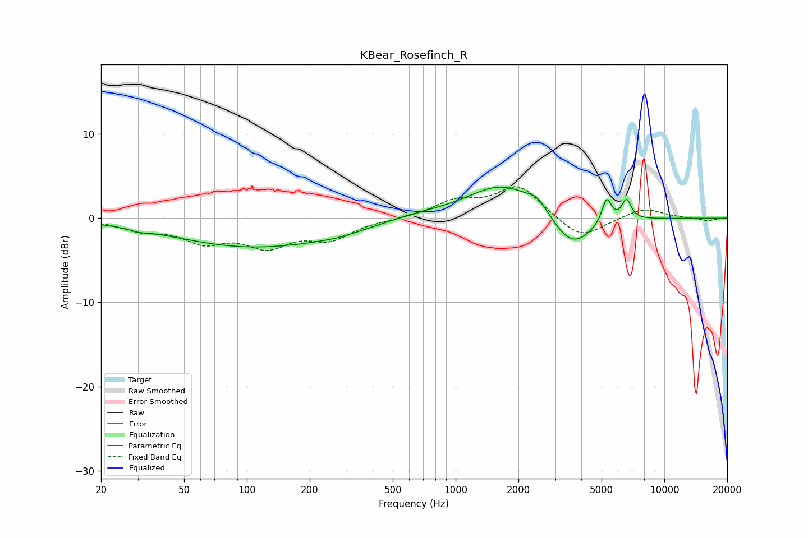

# KBear_Rosefinch_R
See [usage instructions](https://github.com/jaakkopasanen/AutoEq#usage) for more options and info.

### Parametric EQs
Apply preamp of -3.8 dB when using parametric equalizer.

|   # | Type    |   Fc (Hz) |    Q |   Gain (dB) |
|-----|---------|-----------|------|-------------|
|   1 | Peaking |        30 | 3.47 |        -0.3 |
|   2 | Peaking |       108 | 0.36 |        -3.4 |
|   3 | Peaking |       282 | 1.09 |        -0.5 |
|   4 | Peaking |       448 | 1.9  |        -0.1 |
|   5 | Peaking |       594 | 0.84 |         0.5 |
|   6 | Peaking |      1683 | 0.84 |         4.1 |
|   7 | Peaking |      2469 | 2.93 |         1.3 |
|   8 | Peaking |      3605 | 1.42 |        -4.1 |
|   9 | Peaking |      5293 | 5.99 |         3   |
|  10 | Peaking |      6584 | 6    |         2.4 |

### Fixed Band EQs
When using fixed band (also called graphic) equalizer, apply preamp of **-3.8 dB** (if available) and set gains manually with these parameters.

|   # | Type    |   Fc (Hz) |    Q |   Gain (dB) |
|-----|---------|-----------|------|-------------|
|   1 | Peaking |        31 | 1.41 |        -1.2 |
|   2 | Peaking |        62 | 1.41 |        -2.5 |
|   3 | Peaking |       125 | 1.41 |        -3   |
|   4 | Peaking |       250 | 1.41 |        -2.2 |
|   5 | Peaking |       500 | 1.41 |        -0.1 |
|   6 | Peaking |      1000 | 1.41 |         1.9 |
|   7 | Peaking |      2000 | 1.41 |         3.8 |
|   8 | Peaking |      4000 | 1.41 |        -2.6 |
|   9 | Peaking |      8000 | 1.41 |         1.2 |
|  10 | Peaking |     16000 | 1.41 |        -0.3 |

### Graphs

