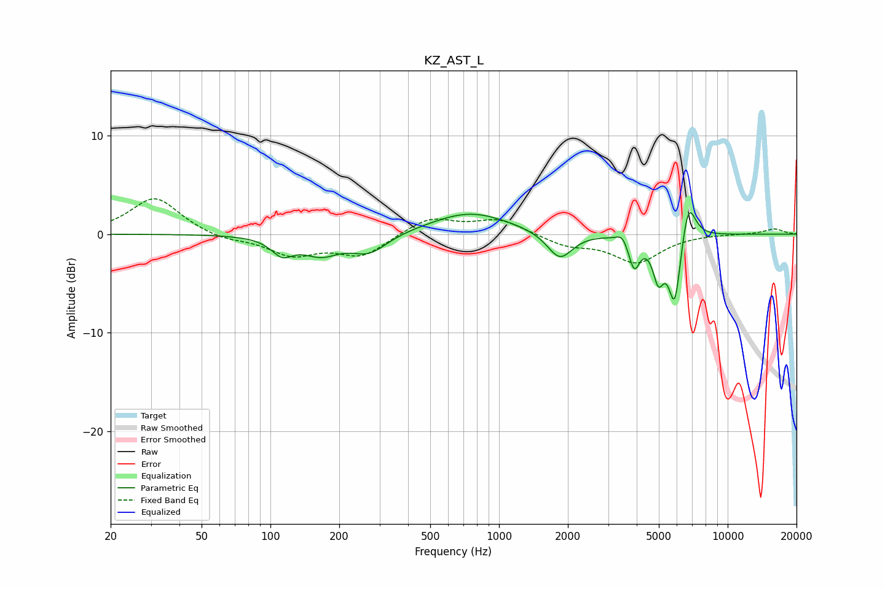

# KZ_AST_L
See [usage instructions](https://github.com/jaakkopasanen/AutoEq#usage) for more options and info.

### Parametric EQs
Apply preamp of -2.3 dB when using parametric equalizer.

|   # | Type    |   Fc (Hz) |    Q |   Gain (dB) |
|-----|---------|-----------|------|-------------|
|   1 | Peaking |       113 | 3    |        -1.7 |
|   2 | Peaking |       166 | 1.74 |        -1.9 |
|   3 | Peaking |       271 | 1.79 |        -1.9 |
|   4 | Peaking |       748 | 0.82 |         2.2 |
|   5 | Peaking |      1845 | 2.57 |        -2.8 |
|   6 | Peaking |      3463 | 5.98 |         0.9 |
|   7 | Peaking |      3901 | 5.83 |        -3.1 |
|   8 | Peaking |      4974 | 5.73 |        -3.8 |
|   9 | Peaking |      5871 | 4.98 |        -7.3 |
|  10 | Peaking |      6718 | 4.35 |         4.4 |

### Fixed Band EQs
When using fixed band (also called graphic) equalizer, apply preamp of **-3.7 dB** (if available) and set gains manually with these parameters.

|   # | Type    |   Fc (Hz) |    Q |   Gain (dB) |
|-----|---------|-----------|------|-------------|
|   1 | Peaking |        31 | 1.41 |         3.8 |
|   2 | Peaking |        62 | 1.41 |        -0.6 |
|   3 | Peaking |       125 | 1.41 |        -2   |
|   4 | Peaking |       250 | 1.41 |        -2.2 |
|   5 | Peaking |       500 | 1.41 |         1.7 |
|   6 | Peaking |      1000 | 1.41 |         1.5 |
|   7 | Peaking |      2000 | 1.41 |        -1.1 |
|   8 | Peaking |      4000 | 1.41 |        -2.8 |
|   9 | Peaking |      8000 | 1.41 |         0   |
|  10 | Peaking |     16000 | 1.41 |         0.5 |

### Graphs

