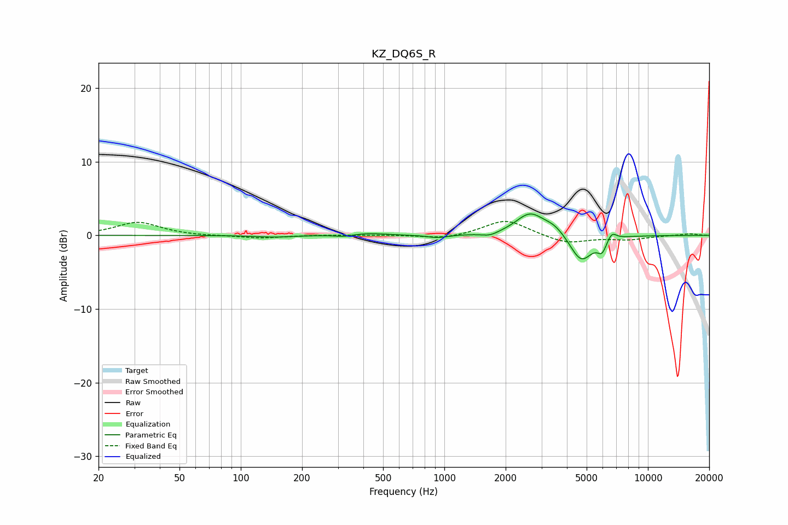

# KZ_DQ6S_R
See [usage instructions](https://github.com/jaakkopasanen/AutoEq#usage) for more options and info.

### Parametric EQs
Apply preamp of -3.0 dB when using parametric equalizer.

|   # | Type    |   Fc (Hz) |    Q |   Gain (dB) |
|-----|---------|-----------|------|-------------|
|   1 | Peaking |       146 | 1.58 |        -0.2 |
|   2 | Peaking |       320 | 3.55 |        -0.2 |
|   3 | Peaking |       425 | 1.72 |         0.3 |
|   4 | Peaking |       925 | 2.89 |        -0.4 |
|   5 | Peaking |      1674 | 3.41 |        -0.5 |
|   6 | Peaking |      2633 | 2.01 |         2.9 |
|   7 | Peaking |      3481 | 2.51 |         1.1 |
|   8 | Peaking |      4698 | 2.54 |        -3.7 |
|   9 | Peaking |      5957 | 6    |        -1.7 |
|  10 | Peaking |      6639 | 6    |         1.1 |

### Fixed Band EQs
When using fixed band (also called graphic) equalizer, apply preamp of **-2.0 dB** (if available) and set gains manually with these parameters.

|   # | Type    |   Fc (Hz) |    Q |   Gain (dB) |
|-----|---------|-----------|------|-------------|
|   1 | Peaking |        31 | 1.41 |         1.8 |
|   2 | Peaking |        62 | 1.41 |        -0.1 |
|   3 | Peaking |       125 | 1.41 |        -0.4 |
|   4 | Peaking |       250 | 1.41 |         0   |
|   5 | Peaking |       500 | 1.41 |         0.1 |
|   6 | Peaking |      1000 | 1.41 |        -0.5 |
|   7 | Peaking |      2000 | 1.41 |         2.2 |
|   8 | Peaking |      4000 | 1.41 |        -1.1 |
|   9 | Peaking |      8000 | 1.41 |        -0.5 |
|  10 | Peaking |     16000 | 1.41 |         0.2 |

### Graphs

