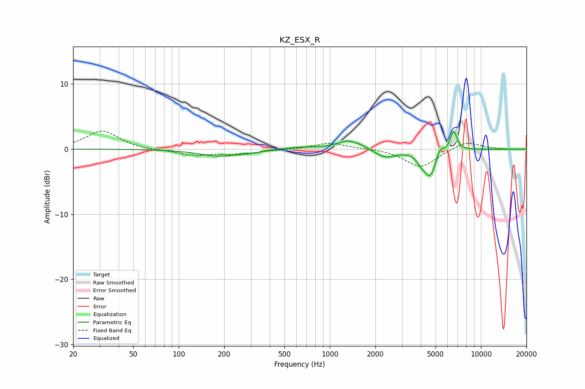

# KZ_ESX_R
See [usage instructions](https://github.com/jaakkopasanen/AutoEq#usage) for more options and info.

### Parametric EQs
Apply preamp of -2.8 dB when using parametric equalizer.

|   # | Type    |   Fc (Hz) |    Q |   Gain (dB) |
|-----|---------|-----------|------|-------------|
|   1 | Peaking |       187 | 1.04 |        -1.1 |
|   2 | Peaking |       321 | 4.94 |        -0.2 |
|   3 | Peaking |       641 | 1.41 |         0.3 |
|   4 | Peaking |      1312 | 2    |         1.3 |
|   5 | Peaking |      1584 | 3.54 |         0.3 |
|   6 | Peaking |      2352 | 2.16 |        -1.3 |
|   7 | Peaking |      3986 | 6    |        -0.7 |
|   8 | Peaking |      4581 | 3.35 |        -4.2 |
|   9 | Peaking |      5352 | 6    |         1.3 |
|  10 | Peaking |      6593 | 6    |         3.1 |

### Fixed Band EQs
When using fixed band (also called graphic) equalizer, apply preamp of **-2.9 dB** (if available) and set gains manually with these parameters.

|   # | Type    |   Fc (Hz) |    Q |   Gain (dB) |
|-----|---------|-----------|------|-------------|
|   1 | Peaking |        31 | 1.41 |         2.8 |
|   2 | Peaking |        62 | 1.41 |        -0.2 |
|   3 | Peaking |       125 | 1.41 |        -0.9 |
|   4 | Peaking |       250 | 1.41 |        -0.8 |
|   5 | Peaking |       500 | 1.41 |        -0.1 |
|   6 | Peaking |      1000 | 1.41 |         1   |
|   7 | Peaking |      2000 | 1.41 |         0.1 |
|   8 | Peaking |      4000 | 1.41 |        -2.8 |
|   9 | Peaking |      8000 | 1.41 |         1.3 |
|  10 | Peaking |     16000 | 1.41 |        -0.1 |

### Graphs

