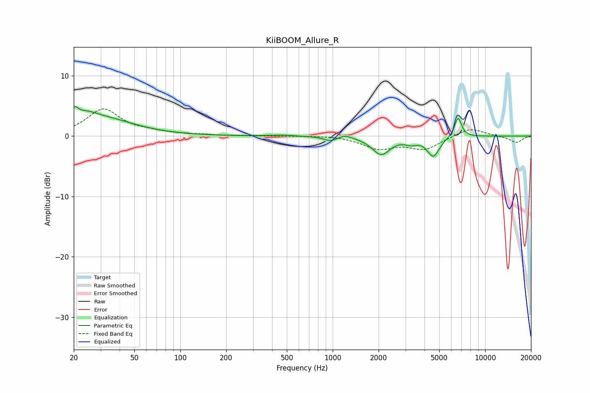

# KiiBOOM_Allure_R
See [usage instructions](https://github.com/jaakkopasanen/AutoEq#usage) for more options and info.

### Parametric EQs
Apply preamp of -5.0 dB when using parametric equalizer.

|   # | Type    |   Fc (Hz) |    Q |   Gain (dB) |
|-----|---------|-----------|------|-------------|
|   1 | Peaking |        20 | 5.93 |         1.9 |
|   2 | Peaking |        24 | 1.97 |         1.5 |
|   3 | Peaking |        31 | 0.69 |         2.7 |
|   4 | Peaking |       462 | 2.08 |         0.2 |
|   5 | Peaking |       962 | 3.44 |        -0.7 |
|   6 | Peaking |      1211 | 3.79 |         0.5 |
|   7 | Peaking |      2077 | 2.41 |        -2.9 |
|   8 | Peaking |      3262 | 3.58 |        -0.8 |
|   9 | Peaking |      4575 | 3.51 |        -3.2 |
|  10 | Peaking |      6644 | 5.8  |         3.3 |

### Fixed Band EQs
When using fixed band (also called graphic) equalizer, apply preamp of **-4.6 dB** (if available) and set gains manually with these parameters.

|   # | Type    |   Fc (Hz) |    Q |   Gain (dB) |
|-----|---------|-----------|------|-------------|
|   1 | Peaking |        31 | 1.41 |         4.4 |
|   2 | Peaking |        62 | 1.41 |         0.5 |
|   3 | Peaking |       125 | 1.41 |         0.2 |
|   4 | Peaking |       250 | 1.41 |        -0   |
|   5 | Peaking |       500 | 1.41 |         0   |
|   6 | Peaking |      1000 | 1.41 |         0.1 |
|   7 | Peaking |      2000 | 1.41 |        -1.9 |
|   8 | Peaking |      4000 | 1.41 |        -2.1 |
|   9 | Peaking |      8000 | 1.41 |         1.4 |
|  10 | Peaking |     16000 | 1.41 |        -1.1 |

### Graphs

