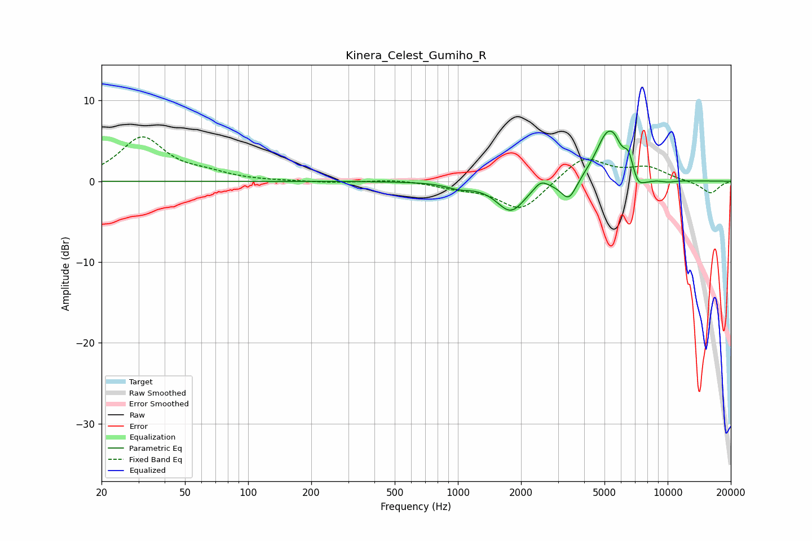

# Kinera_Celest_Gumiho_R
See [usage instructions](https://github.com/jaakkopasanen/AutoEq#usage) for more options and info.

### Parametric EQs
Apply preamp of -6.3 dB when using parametric equalizer.

|   # | Type    |   Fc (Hz) |    Q |   Gain (dB) |
|-----|---------|-----------|------|-------------|
|   1 | Peaking |      1009 | 2.41 |        -0.6 |
|   2 | Peaking |      1788 | 2.06 |        -3.7 |
|   3 | Peaking |      2484 | 4.28 |         1   |
|   4 | Peaking |      3382 | 3.72 |        -2.7 |
|   5 | Peaking |      5186 | 2.38 |         6.1 |
|   6 | Peaking |      5606 | 6    |         0.7 |
|   7 | Peaking |      6510 | 6    |         2   |
|   8 | Peaking |      7195 | 5.46 |        -1.3 |
|   9 | Peaking |      7716 | 3.04 |        -0.7 |
|  10 | Peaking |     10000 | 2.87 |        -0.3 |

### Fixed Band EQs
When using fixed band (also called graphic) equalizer, apply preamp of **-5.6 dB** (if available) and set gains manually with these parameters.

|   # | Type    |   Fc (Hz) |    Q |   Gain (dB) |
|-----|---------|-----------|------|-------------|
|   1 | Peaking |        31 | 1.41 |         5.4 |
|   2 | Peaking |        62 | 1.41 |         0.8 |
|   3 | Peaking |       125 | 1.41 |         0   |
|   4 | Peaking |       250 | 1.41 |        -0.2 |
|   5 | Peaking |       500 | 1.41 |         0.3 |
|   6 | Peaking |      1000 | 1.41 |        -0.6 |
|   7 | Peaking |      2000 | 1.41 |        -3.7 |
|   8 | Peaking |      4000 | 1.41 |         3.1 |
|   9 | Peaking |      8000 | 1.41 |         1.6 |
|  10 | Peaking |     16000 | 1.41 |        -1.5 |

### Graphs

