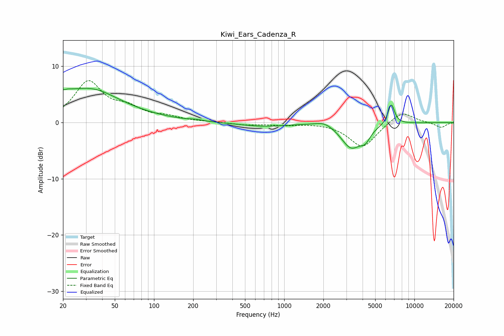

# Kiwi_Ears_Cadenza_R
See [usage instructions](https://github.com/jaakkopasanen/AutoEq#usage) for more options and info.

### Parametric EQs
Apply preamp of -6.2 dB when using parametric equalizer.

|   # | Type    |   Fc (Hz) |    Q |   Gain (dB) |
|-----|---------|-----------|------|-------------|
|   1 | Peaking |        21 | 5.79 |        -3.3 |
|   2 | Peaking |        21 | 5.49 |         3.5 |
|   3 | Peaking |        22 | 0.34 |         5   |
|   4 | Peaking |        36 | 0.97 |         1.5 |
|   5 | Peaking |       209 | 3.03 |         0.2 |
|   6 | Peaking |       684 | 0.79 |        -0.7 |
|   7 | Peaking |      2040 | 1.99 |         0.9 |
|   8 | Peaking |      3263 | 1.81 |        -4.3 |
|   9 | Peaking |      4201 | 3.52 |        -1.8 |
|  10 | Peaking |      6647 | 5.26 |         3.7 |

### Fixed Band EQs
When using fixed band (also called graphic) equalizer, apply preamp of **-7.6 dB** (if available) and set gains manually with these parameters.

|   # | Type    |   Fc (Hz) |    Q |   Gain (dB) |
|-----|---------|-----------|------|-------------|
|   1 | Peaking |        31 | 1.41 |         7   |
|   2 | Peaking |        62 | 1.41 |         2.1 |
|   3 | Peaking |       125 | 1.41 |         0.8 |
|   4 | Peaking |       250 | 1.41 |         0.1 |
|   5 | Peaking |       500 | 1.41 |        -0.4 |
|   6 | Peaking |      1000 | 1.41 |        -0.4 |
|   7 | Peaking |      2000 | 1.41 |         0   |
|   8 | Peaking |      4000 | 1.41 |        -4.5 |
|   9 | Peaking |      8000 | 1.41 |         2.2 |
|  10 | Peaking |     16000 | 1.41 |        -0.9 |

### Graphs

