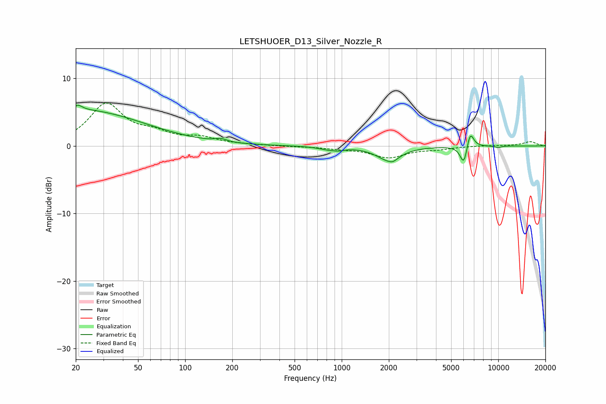

# LETSHUOER_D13_Silver_Nozzle_R
See [usage instructions](https://github.com/jaakkopasanen/AutoEq#usage) for more options and info.

### Parametric EQs
Apply preamp of -6.1 dB when using parametric equalizer.

|   # | Type    |   Fc (Hz) |    Q |   Gain (dB) |
|-----|---------|-----------|------|-------------|
|   1 | Peaking |        21 | 5.39 |         0.7 |
|   2 | Peaking |        22 | 0.35 |         5.3 |
|   3 | Peaking |       169 | 3.8  |         0.5 |
|   4 | Peaking |       834 | 2.18 |        -0.5 |
|   5 | Peaking |       965 | 4.38 |        -0.2 |
|   6 | Peaking |      1998 | 1.81 |        -2   |
|   7 | Peaking |      2121 | 5.94 |        -0.4 |
|   8 | Peaking |      6031 | 5.87 |        -3   |
|   9 | Peaking |      6609 | 6    |         2.6 |
|  10 | Peaking |     10000 | 6    |        -0.2 |

### Fixed Band EQs
When using fixed band (also called graphic) equalizer, apply preamp of **-6.4 dB** (if available) and set gains manually with these parameters.

|   # | Type    |   Fc (Hz) |    Q |   Gain (dB) |
|-----|---------|-----------|------|-------------|
|   1 | Peaking |        31 | 1.41 |         6   |
|   2 | Peaking |        62 | 1.41 |         1.5 |
|   3 | Peaking |       125 | 1.41 |         1   |
|   4 | Peaking |       250 | 1.41 |         0.1 |
|   5 | Peaking |       500 | 1.41 |        -0.1 |
|   6 | Peaking |      1000 | 1.41 |        -0.3 |
|   7 | Peaking |      2000 | 1.41 |        -1.7 |
|   8 | Peaking |      4000 | 1.41 |        -0.4 |
|   9 | Peaking |      8000 | 1.41 |         0.1 |
|  10 | Peaking |     16000 | 1.41 |         0.6 |

### Graphs

