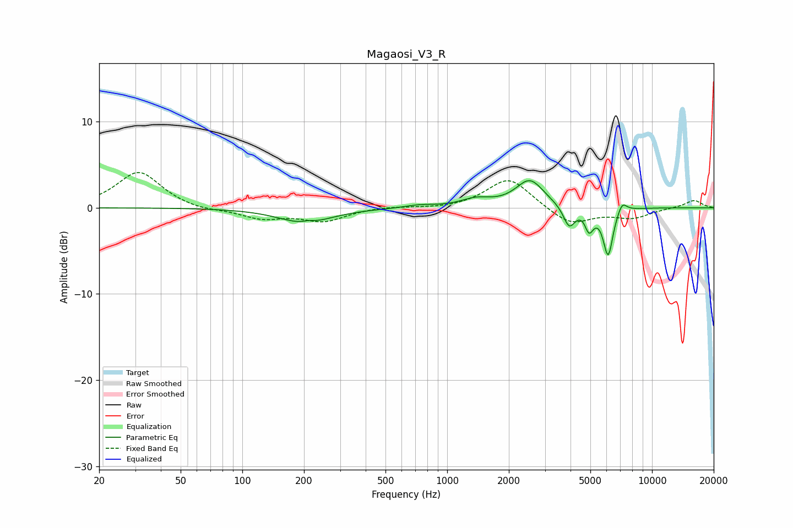

# Magaosi_V3_R
See [usage instructions](https://github.com/jaakkopasanen/AutoEq#usage) for more options and info.

### Parametric EQs
Apply preamp of -3.2 dB when using parametric equalizer.

|   # | Type    |   Fc (Hz) |    Q |   Gain (dB) |
|-----|---------|-----------|------|-------------|
|   1 | Peaking |       202 | 1.11 |        -1.7 |
|   2 | Peaking |       210 | 5.31 |         0.2 |
|   3 | Peaking |       732 | 2.07 |         0.3 |
|   4 | Peaking |      1383 | 1.96 |         0.9 |
|   5 | Peaking |      2533 | 2.07 |         3.2 |
|   6 | Peaking |      3940 | 4.97 |        -2.4 |
|   7 | Peaking |      4720 | 6    |         0.7 |
|   8 | Peaking |      4905 | 5.98 |        -2.8 |
|   9 | Peaking |      6106 | 5.81 |        -5.5 |
|  10 | Peaking |      7143 | 6    |         1.3 |

### Fixed Band EQs
When using fixed band (also called graphic) equalizer, apply preamp of **-4.2 dB** (if available) and set gains manually with these parameters.

|   # | Type    |   Fc (Hz) |    Q |   Gain (dB) |
|-----|---------|-----------|------|-------------|
|   1 | Peaking |        31 | 1.41 |         4.2 |
|   2 | Peaking |        62 | 1.41 |        -0.4 |
|   3 | Peaking |       125 | 1.41 |        -1.2 |
|   4 | Peaking |       250 | 1.41 |        -1.5 |
|   5 | Peaking |       500 | 1.41 |         0.2 |
|   6 | Peaking |      1000 | 1.41 |        -0.2 |
|   7 | Peaking |      2000 | 1.41 |         3.5 |
|   8 | Peaking |      4000 | 1.41 |        -2   |
|   9 | Peaking |      8000 | 1.41 |        -1.1 |
|  10 | Peaking |     16000 | 1.41 |         0.9 |

### Graphs

