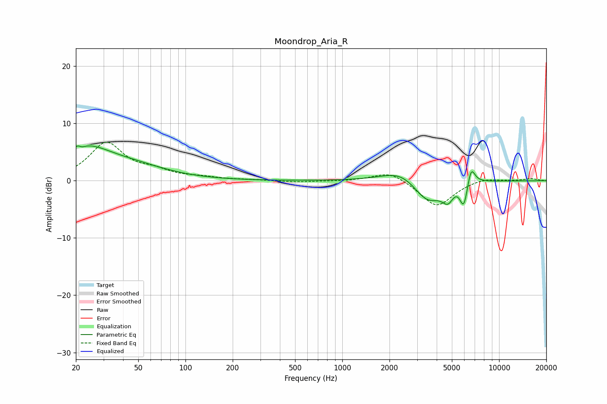

# Moondrop_Aria_R
See [usage instructions](https://github.com/jaakkopasanen/AutoEq#usage) for more options and info.

### Parametric EQs
Apply preamp of -6.2 dB when using parametric equalizer.

|   # | Type    |   Fc (Hz) |    Q |   Gain (dB) |
|-----|---------|-----------|------|-------------|
|   1 | Peaking |        21 | 5.78 |         3.1 |
|   2 | Peaking |        21 | 5.88 |        -3   |
|   3 | Peaking |        23 | 0.83 |         5.2 |
|   4 | Peaking |        48 | 0.64 |         1.8 |
|   5 | Peaking |      2405 | 1.15 |         2.3 |
|   6 | Peaking |      3487 | 1.5  |        -4.3 |
|   7 | Peaking |      4733 | 3.61 |        -3   |
|   8 | Peaking |      5598 | 2    |         1.7 |
|   9 | Peaking |      5962 | 4.85 |        -5.4 |
|  10 | Peaking |      6611 | 5.47 |         3.5 |

### Fixed Band EQs
When using fixed band (also called graphic) equalizer, apply preamp of **-6.8 dB** (if available) and set gains manually with these parameters.

|   # | Type    |   Fc (Hz) |    Q |   Gain (dB) |
|-----|---------|-----------|------|-------------|
|   1 | Peaking |        31 | 1.41 |         6.5 |
|   2 | Peaking |        62 | 1.41 |         1.3 |
|   3 | Peaking |       125 | 1.41 |         0.5 |
|   4 | Peaking |       250 | 1.41 |         0.1 |
|   5 | Peaking |       500 | 1.41 |        -0.2 |
|   6 | Peaking |      1000 | 1.41 |        -0.1 |
|   7 | Peaking |      2000 | 1.41 |         1.8 |
|   8 | Peaking |      4000 | 1.41 |        -4.6 |
|   9 | Peaking |      8000 | 1.41 |         0.6 |
|  10 | Peaking |     16000 | 1.41 |         0.4 |

### Graphs

