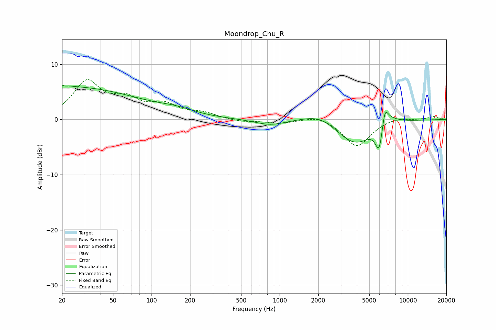

# Moondrop_Chu_R
See [usage instructions](https://github.com/jaakkopasanen/AutoEq#usage) for more options and info.

### Parametric EQs
Apply preamp of -6.3 dB when using parametric equalizer.

|   # | Type    |   Fc (Hz) |    Q |   Gain (dB) |
|-----|---------|-----------|------|-------------|
|   1 | Peaking |        20 | 0.22 |         5.9 |
|   2 | Peaking |        21 | 5.54 |         3.3 |
|   3 | Peaking |        21 | 5.93 |        -3.1 |
|   4 | Peaking |       157 | 1    |         0.9 |
|   5 | Peaking |       846 | 1.18 |        -1   |
|   6 | Peaking |      2108 | 1.01 |         2   |
|   7 | Peaking |      3905 | 0.89 |        -5.1 |
|   8 | Peaking |      6002 | 4.27 |        -6.2 |
|   9 | Peaking |      6531 | 1.54 |         2.7 |
|  10 | Peaking |      6597 | 5.26 |         3.7 |

### Fixed Band EQs
When using fixed band (also called graphic) equalizer, apply preamp of **-7.3 dB** (if available) and set gains manually with these parameters.

|   # | Type    |   Fc (Hz) |    Q |   Gain (dB) |
|-----|---------|-----------|------|-------------|
|   1 | Peaking |        31 | 1.41 |         6.6 |
|   2 | Peaking |        62 | 1.41 |         3   |
|   3 | Peaking |       125 | 1.41 |         2.3 |
|   4 | Peaking |       250 | 1.41 |         1   |
|   5 | Peaking |       500 | 1.41 |        -0.4 |
|   6 | Peaking |      1000 | 1.41 |        -0.7 |
|   7 | Peaking |      2000 | 1.41 |         0.9 |
|   8 | Peaking |      4000 | 1.41 |        -4.9 |
|   9 | Peaking |      8000 | 1.41 |         0.5 |
|  10 | Peaking |     16000 | 1.41 |         0.5 |

### Graphs

