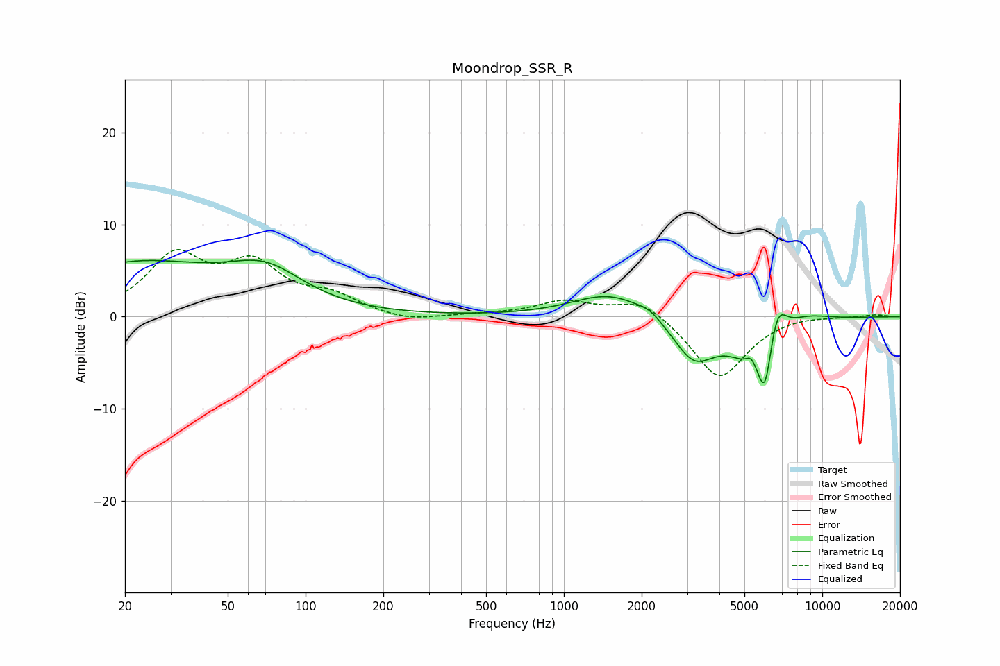

# Moondrop_SSR_R
See [usage instructions](https://github.com/jaakkopasanen/AutoEq#usage) for more options and info.

### Parametric EQs
Apply preamp of -6.2 dB when using parametric equalizer.

|   # | Type    |   Fc (Hz) |    Q |   Gain (dB) |
|-----|---------|-----------|------|-------------|
|   1 | Peaking |        22 | 0.43 |         5.6 |
|   2 | Peaking |        70 | 0.96 |         3.7 |
|   3 | Peaking |      1517 | 0.98 |         2.7 |
|   4 | Peaking |      2153 | 3.12 |         0.7 |
|   5 | Peaking |      3183 | 1.73 |        -4.5 |
|   6 | Peaking |      5323 | 5.98 |         1.7 |
|   7 | Peaking |      5819 | 1.59 |        -7.2 |
|   8 | Peaking |      6017 | 6    |        -4.1 |
|   9 | Peaking |      6659 | 3.29 |         5.8 |
|  10 | Peaking |      8408 | 1.38 |         1.4 |

### Fixed Band EQs
When using fixed band (also called graphic) equalizer, apply preamp of **-7.4 dB** (if available) and set gains manually with these parameters.

|   # | Type    |   Fc (Hz) |    Q |   Gain (dB) |
|-----|---------|-----------|------|-------------|
|   1 | Peaking |        31 | 1.41 |         6.2 |
|   2 | Peaking |        62 | 1.41 |         5.1 |
|   3 | Peaking |       125 | 1.41 |         1.9 |
|   4 | Peaking |       250 | 1.41 |        -0.6 |
|   5 | Peaking |       500 | 1.41 |         0.2 |
|   6 | Peaking |      1000 | 1.41 |         1.6 |
|   7 | Peaking |      2000 | 1.41 |         2   |
|   8 | Peaking |      4000 | 1.41 |        -6.8 |
|   9 | Peaking |      8000 | 1.41 |         0.3 |
|  10 | Peaking |     16000 | 1.41 |         0.2 |

### Graphs

