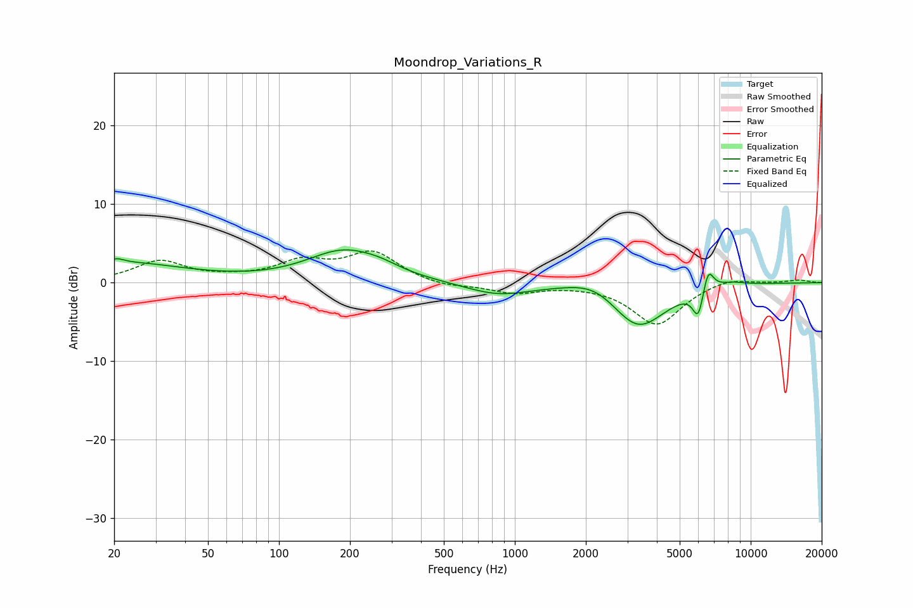

# Moondrop_Variations_R
See [usage instructions](https://github.com/jaakkopasanen/AutoEq#usage) for more options and info.

### Parametric EQs
Apply preamp of -4.3 dB when using parametric equalizer.

|   # | Type    |   Fc (Hz) |    Q |   Gain (dB) |
|-----|---------|-----------|------|-------------|
|   1 | Peaking |        20 | 4.9  |         0.5 |
|   2 | Peaking |        22 | 0.53 |         2.4 |
|   3 | Peaking |       188 | 0.91 |         3.9 |
|   4 | Peaking |       270 | 1.7  |         0.6 |
|   5 | Peaking |       846 | 1.02 |        -1.6 |
|   6 | Peaking |      2200 | 1.29 |         1.8 |
|   7 | Peaking |      3325 | 1.2  |        -6   |
|   8 | Peaking |      5997 | 6    |        -3.6 |
|   9 | Peaking |      6599 | 5.97 |         3.1 |
|  10 | Peaking |      8162 | 1.99 |         0.6 |

### Fixed Band EQs
When using fixed band (also called graphic) equalizer, apply preamp of **-4.1 dB** (if available) and set gains manually with these parameters.

|   # | Type    |   Fc (Hz) |    Q |   Gain (dB) |
|-----|---------|-----------|------|-------------|
|   1 | Peaking |        31 | 1.41 |         2.7 |
|   2 | Peaking |        62 | 1.41 |         0.4 |
|   3 | Peaking |       125 | 1.41 |         2.4 |
|   4 | Peaking |       250 | 1.41 |         3.7 |
|   5 | Peaking |       500 | 1.41 |        -0.6 |
|   6 | Peaking |      1000 | 1.41 |        -1.3 |
|   7 | Peaking |      2000 | 1.41 |        -0.1 |
|   8 | Peaking |      4000 | 1.41 |        -5.3 |
|   9 | Peaking |      8000 | 1.41 |         0.8 |
|  10 | Peaking |     16000 | 1.41 |         0.3 |

### Graphs

