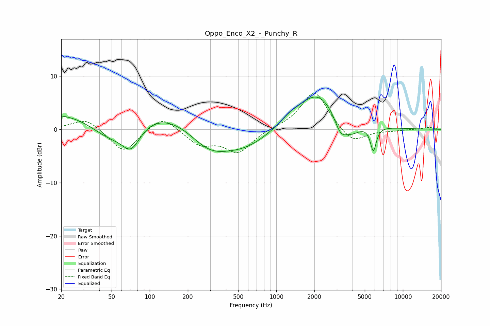

# Oppo_Enco_X2_-_Punchy_R
See [usage instructions](https://github.com/jaakkopasanen/AutoEq#usage) for more options and info.

### Parametric EQs
Apply preamp of -6.2 dB when using parametric equalizer.

|   # | Type    |   Fc (Hz) |    Q |   Gain (dB) |
|-----|---------|-----------|------|-------------|
|   1 | Peaking |        49 | 0.74 |        -6   |
|   2 | Peaking |        67 | 0.18 |         6   |
|   3 | Peaking |        71 | 1.94 |        -4.5 |
|   4 | Peaking |       293 | 0.8  |        -5.5 |
|   5 | Peaking |       574 | 0.7  |        -3.6 |
|   6 | Peaking |      1275 | 2.29 |         0.7 |
|   7 | Peaking |      2114 | 0.8  |         7.3 |
|   8 | Peaking |      3222 | 2.68 |        -3.8 |
|   9 | Peaking |      3977 | 1.98 |        -2.3 |
|  10 | Peaking |      5843 | 6    |        -4.6 |

### Fixed Band EQs
When using fixed band (also called graphic) equalizer, apply preamp of **-6.8 dB** (if available) and set gains manually with these parameters.

|   # | Type    |   Fc (Hz) |    Q |   Gain (dB) |
|-----|---------|-----------|------|-------------|
|   1 | Peaking |        31 | 1.41 |         2.2 |
|   2 | Peaking |        62 | 1.41 |        -4.5 |
|   3 | Peaking |       125 | 1.41 |         2.9 |
|   4 | Peaking |       250 | 1.41 |        -2.7 |
|   5 | Peaking |       500 | 1.41 |        -4.2 |
|   6 | Peaking |      1000 | 1.41 |         0.2 |
|   7 | Peaking |      2000 | 1.41 |         7.4 |
|   8 | Peaking |      4000 | 1.41 |        -2.9 |
|   9 | Peaking |      8000 | 1.41 |        -0.2 |
|  10 | Peaking |     16000 | 1.41 |         0.4 |

### Graphs

