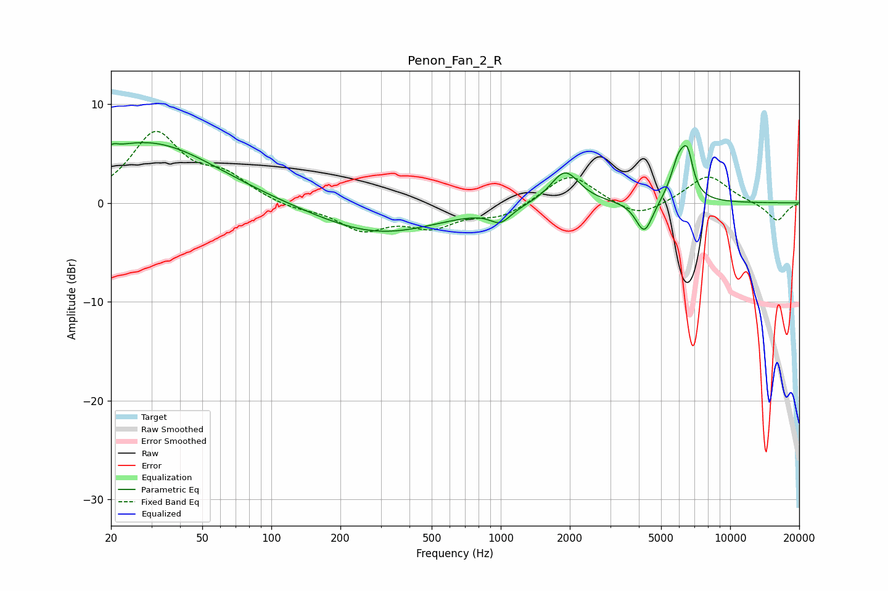

# Penon_Fan_2_R
See [usage instructions](https://github.com/jaakkopasanen/AutoEq#usage) for more options and info.

### Parametric EQs
Apply preamp of -6.2 dB when using parametric equalizer.

|   # | Type    |   Fc (Hz) |    Q |   Gain (dB) |
|-----|---------|-----------|------|-------------|
|   1 | Peaking |        20 | 0.88 |         1   |
|   2 | Peaking |        20 | 5.82 |         3.1 |
|   3 | Peaking |        21 | 5.75 |        -2.6 |
|   4 | Peaking |        31 | 0.51 |         5.5 |
|   5 | Peaking |       294 | 0.52 |        -3.1 |
|   6 | Peaking |       997 | 3.08 |        -1.4 |
|   7 | Peaking |      1905 | 2.26 |         3.4 |
|   8 | Peaking |      4226 | 3.77 |        -3.3 |
|   9 | Peaking |      5977 | 3.81 |         4.1 |
|  10 | Peaking |      6531 | 5.77 |         3.3 |

### Fixed Band EQs
When using fixed band (also called graphic) equalizer, apply preamp of **-7.3 dB** (if available) and set gains manually with these parameters.

|   # | Type    |   Fc (Hz) |    Q |   Gain (dB) |
|-----|---------|-----------|------|-------------|
|   1 | Peaking |        31 | 1.41 |         6.9 |
|   2 | Peaking |        62 | 1.41 |         2.3 |
|   3 | Peaking |       125 | 1.41 |        -0.6 |
|   4 | Peaking |       250 | 1.41 |        -2.5 |
|   5 | Peaking |       500 | 1.41 |        -2.1 |
|   6 | Peaking |      1000 | 1.41 |        -1.4 |
|   7 | Peaking |      2000 | 1.41 |         3.1 |
|   8 | Peaking |      4000 | 1.41 |        -1.6 |
|   9 | Peaking |      8000 | 1.41 |         2.9 |
|  10 | Peaking |     16000 | 1.41 |        -1.9 |

### Graphs

