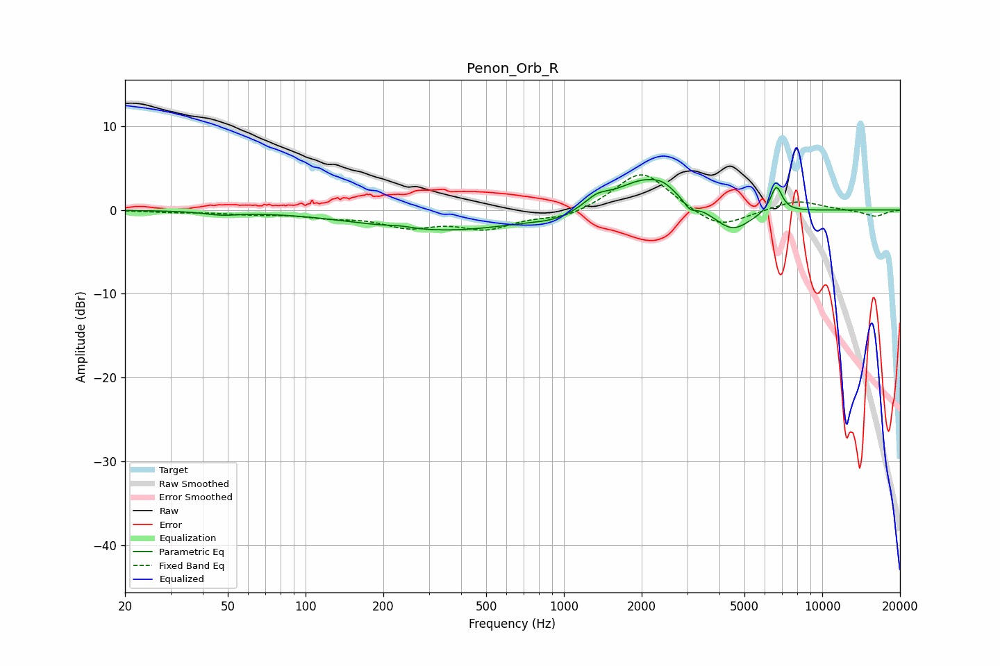

# Penon_Orb_R
See [usage instructions](https://github.com/jaakkopasanen/AutoEq#usage) for more options and info.

### Parametric EQs
Apply preamp of -3.7 dB when using parametric equalizer.

|   # | Type    |   Fc (Hz) |    Q |   Gain (dB) |
|-----|---------|-----------|------|-------------|
|   1 | Peaking |        47 | 2.17 |        -0.4 |
|   2 | Peaking |       232 | 3    |         0.2 |
|   3 | Peaking |       344 | 0.45 |        -2.5 |
|   4 | Peaking |       931 | 1.56 |        -0.7 |
|   5 | Peaking |      1340 | 3.07 |         1.1 |
|   6 | Peaking |      2084 | 1.16 |         3.9 |
|   7 | Peaking |      2420 | 3.85 |         0.5 |
|   8 | Peaking |      3078 | 5.67 |        -1.1 |
|   9 | Peaking |      4473 | 1.87 |        -2.9 |
|  10 | Peaking |      6644 | 6    |         3.2 |

### Fixed Band EQs
When using fixed band (also called graphic) equalizer, apply preamp of **-4.3 dB** (if available) and set gains manually with these parameters.

|   # | Type    |   Fc (Hz) |    Q |   Gain (dB) |
|-----|---------|-----------|------|-------------|
|   1 | Peaking |        31 | 1.41 |        -0.2 |
|   2 | Peaking |        62 | 1.41 |        -0.4 |
|   3 | Peaking |       125 | 1.41 |        -0.7 |
|   4 | Peaking |       250 | 1.41 |        -1.8 |
|   5 | Peaking |       500 | 1.41 |        -2   |
|   6 | Peaking |      1000 | 1.41 |        -1   |
|   7 | Peaking |      2000 | 1.41 |         4.8 |
|   8 | Peaking |      4000 | 1.41 |        -2.4 |
|   9 | Peaking |      8000 | 1.41 |         1.2 |
|  10 | Peaking |     16000 | 1.41 |        -0.8 |

### Graphs

