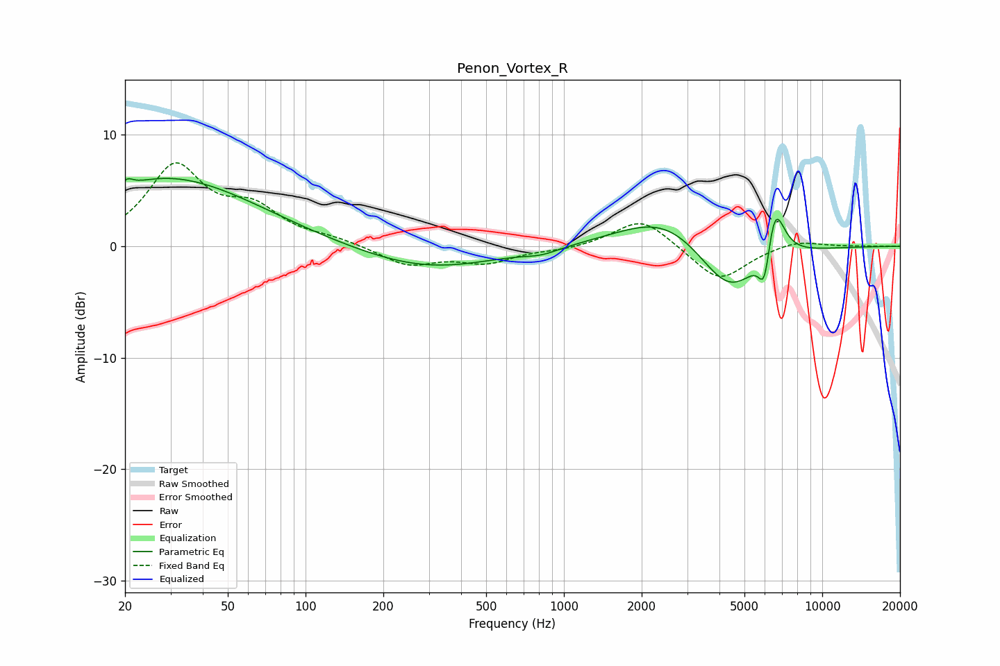

# Penon_Vortex_R
See [usage instructions](https://github.com/jaakkopasanen/AutoEq#usage) for more options and info.

### Parametric EQs
Apply preamp of -6.2 dB when using parametric equalizer.

|   # | Type    |   Fc (Hz) |    Q |   Gain (dB) |
|-----|---------|-----------|------|-------------|
|   1 | Peaking |        20 | 5.46 |        -2.5 |
|   2 | Peaking |        20 | 5.66 |         3.2 |
|   3 | Peaking |        24 | 0.78 |         1   |
|   4 | Peaking |        33 | 0.43 |         5.3 |
|   5 | Peaking |       298 | 0.54 |        -2.1 |
|   6 | Peaking |       820 | 2.11 |        -0.5 |
|   7 | Peaking |      2499 | 0.79 |         3.2 |
|   8 | Peaking |      4374 | 1.14 |        -5.1 |
|   9 | Peaking |      5980 | 6    |        -3.9 |
|  10 | Peaking |      6529 | 3.56 |         5.5 |

### Fixed Band EQs
When using fixed band (also called graphic) equalizer, apply preamp of **-7.6 dB** (if available) and set gains manually with these parameters.

|   # | Type    |   Fc (Hz) |    Q |   Gain (dB) |
|-----|---------|-----------|------|-------------|
|   1 | Peaking |        31 | 1.41 |         6.9 |
|   2 | Peaking |        62 | 1.41 |         2.9 |
|   3 | Peaking |       125 | 1.41 |         0.5 |
|   4 | Peaking |       250 | 1.41 |        -1.7 |
|   5 | Peaking |       500 | 1.41 |        -1.4 |
|   6 | Peaking |      1000 | 1.41 |        -0.3 |
|   7 | Peaking |      2000 | 1.41 |         2.7 |
|   8 | Peaking |      4000 | 1.41 |        -3.2 |
|   9 | Peaking |      8000 | 1.41 |         0.6 |
|  10 | Peaking |     16000 | 1.41 |         0   |

### Graphs

