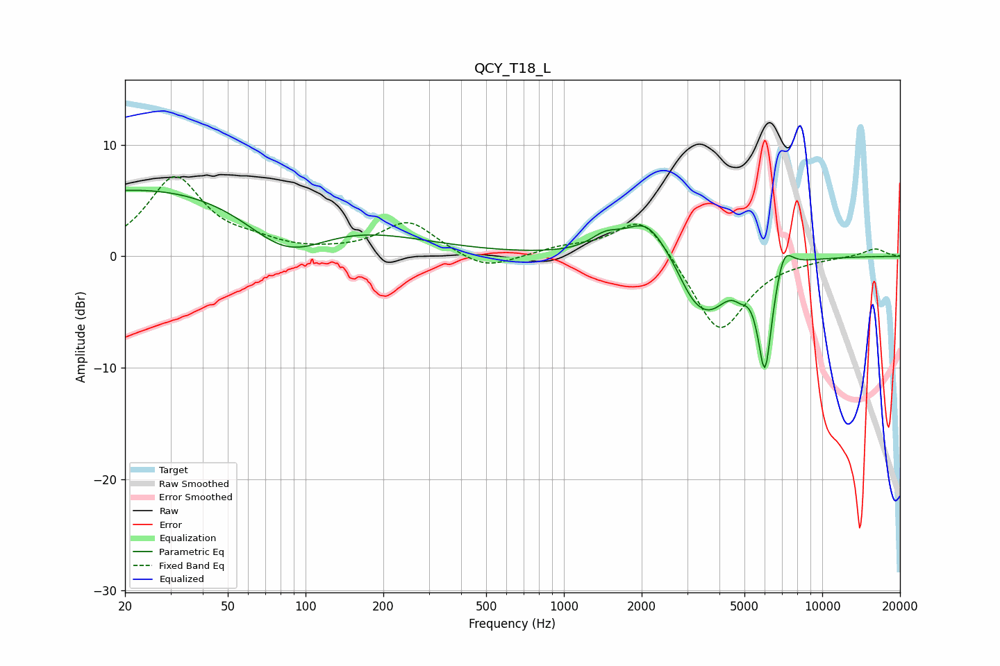

# QCY_T18_L
See [usage instructions](https://github.com/jaakkopasanen/AutoEq#usage) for more options and info.

### Parametric EQs
Apply preamp of -6.0 dB when using parametric equalizer.

|   # | Type    |   Fc (Hz) |    Q |   Gain (dB) |
|-----|---------|-----------|------|-------------|
|   1 | Peaking |        34 | 0.18 |         6.6 |
|   2 | Peaking |        85 | 0.85 |        -4.8 |
|   3 | Peaking |      1449 | 2.4  |         1.3 |
|   4 | Peaking |      2092 | 1.7  |         3.3 |
|   5 | Peaking |      3123 | 2.46 |        -1.8 |
|   6 | Peaking |      3450 | 1.88 |         0.4 |
|   7 | Peaking |      3656 | 1.79 |        -4.4 |
|   8 | Peaking |      4843 | 5.2  |        -0.9 |
|   9 | Peaking |      5998 | 4.83 |        -9.8 |
|  10 | Peaking |      7103 | 4.1  |         2.4 |

### Fixed Band EQs
When using fixed band (also called graphic) equalizer, apply preamp of **-7.2 dB** (if available) and set gains manually with these parameters.

|   # | Type    |   Fc (Hz) |    Q |   Gain (dB) |
|-----|---------|-----------|------|-------------|
|   1 | Peaking |        31 | 1.41 |         7   |
|   2 | Peaking |        62 | 1.41 |         0.8 |
|   3 | Peaking |       125 | 1.41 |         0.2 |
|   4 | Peaking |       250 | 1.41 |         3.1 |
|   5 | Peaking |       500 | 1.41 |        -1.4 |
|   6 | Peaking |      1000 | 1.41 |         0.7 |
|   7 | Peaking |      2000 | 1.41 |         4   |
|   8 | Peaking |      4000 | 1.41 |        -7.1 |
|   9 | Peaking |      8000 | 1.41 |        -0.1 |
|  10 | Peaking |     16000 | 1.41 |         0.7 |

### Graphs

