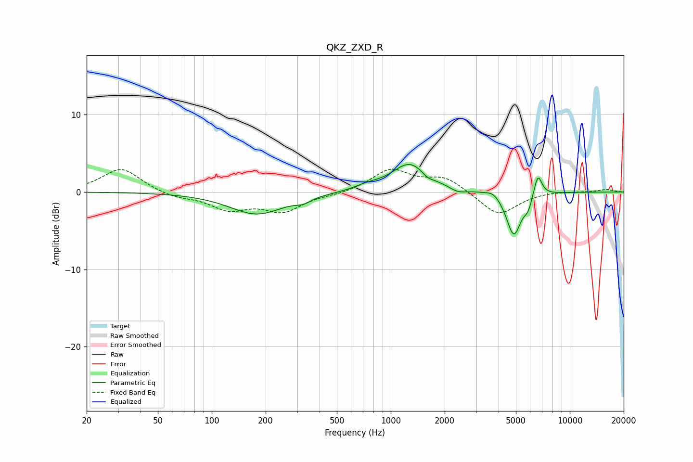

# QKZ_ZXD_R
See [usage instructions](https://github.com/jaakkopasanen/AutoEq#usage) for more options and info.

### Parametric EQs
Apply preamp of -3.7 dB when using parametric equalizer.

|   # | Type    |   Fc (Hz) |    Q |   Gain (dB) |
|-----|---------|-----------|------|-------------|
|   1 | Peaking |       179 | 0.92 |        -2.9 |
|   2 | Peaking |       325 | 3.57 |        -0.6 |
|   3 | Peaking |       738 | 1.99 |         0.5 |
|   4 | Peaking |      1278 | 1.42 |         3.7 |
|   5 | Peaking |      1603 | 4.42 |        -0.6 |
|   6 | Peaking |      2375 | 3.27 |        -0.6 |
|   7 | Peaking |      3727 | 3.8  |         0.6 |
|   8 | Peaking |      4865 | 3.4  |        -5.6 |
|   9 | Peaking |      5852 | 6    |        -1.4 |
|  10 | Peaking |      6634 | 5.97 |         2.9 |

### Fixed Band EQs
When using fixed band (also called graphic) equalizer, apply preamp of **-3.1 dB** (if available) and set gains manually with these parameters.

|   # | Type    |   Fc (Hz) |    Q |   Gain (dB) |
|-----|---------|-----------|------|-------------|
|   1 | Peaking |        31 | 1.41 |         3.1 |
|   2 | Peaking |        62 | 1.41 |        -0.7 |
|   3 | Peaking |       125 | 1.41 |        -2.1 |
|   4 | Peaking |       250 | 1.41 |        -2.4 |
|   5 | Peaking |       500 | 1.41 |        -0.3 |
|   6 | Peaking |      1000 | 1.41 |         2.9 |
|   7 | Peaking |      2000 | 1.41 |         1.8 |
|   8 | Peaking |      4000 | 1.41 |        -3.1 |
|   9 | Peaking |      8000 | 1.41 |         0.1 |
|  10 | Peaking |     16000 | 1.41 |         0.3 |

### Graphs

