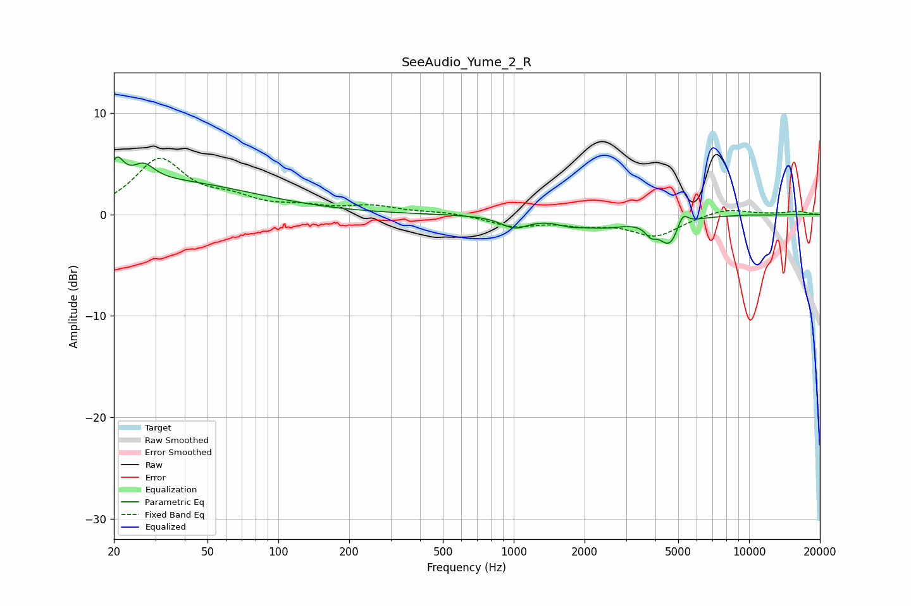

# SeeAudio_Yume_2_R
See [usage instructions](https://github.com/jaakkopasanen/AutoEq#usage) for more options and info.

### Parametric EQs
Apply preamp of -5.8 dB when using parametric equalizer.

|   # | Type    |   Fc (Hz) |    Q |   Gain (dB) |
|-----|---------|-----------|------|-------------|
|   1 | Peaking |        21 | 5.26 |         2.2 |
|   2 | Peaking |        27 | 3.23 |         1.5 |
|   3 | Peaking |        30 | 0.34 |         3.3 |
|   4 | Peaking |      1008 | 2.45 |        -1.1 |
|   5 | Peaking |      1729 | 2.6  |        -0.5 |
|   6 | Peaking |      2394 | 1.29 |        -1   |
|   7 | Peaking |      3827 | 5.93 |        -0.9 |
|   8 | Peaking |      4606 | 3.17 |        -2.8 |
|   9 | Peaking |      5213 | 6    |         1.5 |
|  10 | Peaking |      9721 | 6    |         0   |

### Fixed Band EQs
When using fixed band (also called graphic) equalizer, apply preamp of **-5.7 dB** (if available) and set gains manually with these parameters.

|   # | Type    |   Fc (Hz) |    Q |   Gain (dB) |
|-----|---------|-----------|------|-------------|
|   1 | Peaking |        31 | 1.41 |         5.3 |
|   2 | Peaking |        62 | 1.41 |         1.3 |
|   3 | Peaking |       125 | 1.41 |         0.6 |
|   4 | Peaking |       250 | 1.41 |         0.8 |
|   5 | Peaking |       500 | 1.41 |         0.2 |
|   6 | Peaking |      1000 | 1.41 |        -1.1 |
|   7 | Peaking |      2000 | 1.41 |        -0.8 |
|   8 | Peaking |      4000 | 1.41 |        -2   |
|   9 | Peaking |      8000 | 1.41 |         0.7 |
|  10 | Peaking |     16000 | 1.41 |         0.3 |

### Graphs

