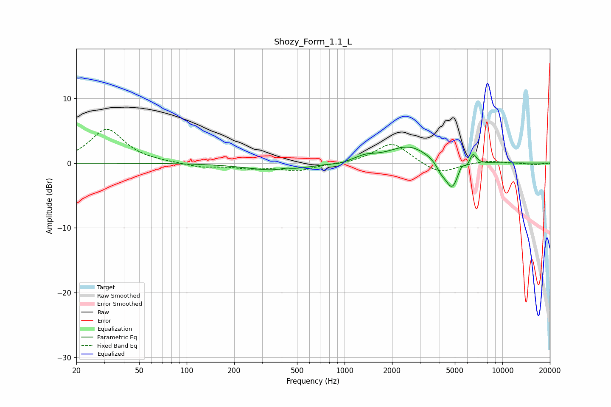

# Shozy_Form_1.1_L
See [usage instructions](https://github.com/jaakkopasanen/AutoEq#usage) for more options and info.

### Parametric EQs
Apply preamp of -2.6 dB when using parametric equalizer.

|   # | Type    |   Fc (Hz) |    Q |   Gain (dB) |
|-----|---------|-----------|------|-------------|
|   1 | Peaking |       376 | 0.76 |        -1.2 |
|   2 | Peaking |       423 | 4.15 |         0.3 |
|   3 | Peaking |       929 | 4.16 |        -0.2 |
|   4 | Peaking |      1356 | 2.11 |         0.8 |
|   5 | Peaking |      2558 | 1.09 |         2.7 |
|   6 | Peaking |      4083 | 4.91 |        -1.1 |
|   7 | Peaking |      4798 | 3.18 |        -4.4 |
|   8 | Peaking |      5513 | 6    |         1.1 |
|   9 | Peaking |      6015 | 6    |        -0.6 |
|  10 | Peaking |      6494 | 6    |         1.9 |

### Fixed Band EQs
When using fixed band (also called graphic) equalizer, apply preamp of **-5.3 dB** (if available) and set gains manually with these parameters.

|   # | Type    |   Fc (Hz) |    Q |   Gain (dB) |
|-----|---------|-----------|------|-------------|
|   1 | Peaking |        31 | 1.41 |         5.2 |
|   2 | Peaking |        62 | 1.41 |         0.1 |
|   3 | Peaking |       125 | 1.41 |        -0.6 |
|   4 | Peaking |       250 | 1.41 |        -0.7 |
|   5 | Peaking |       500 | 1.41 |        -1.1 |
|   6 | Peaking |      1000 | 1.41 |        -0.1 |
|   7 | Peaking |      2000 | 1.41 |         3.2 |
|   8 | Peaking |      4000 | 1.41 |        -1.8 |
|   9 | Peaking |      8000 | 1.41 |         0.4 |
|  10 | Peaking |     16000 | 1.41 |        -0.3 |

### Graphs

