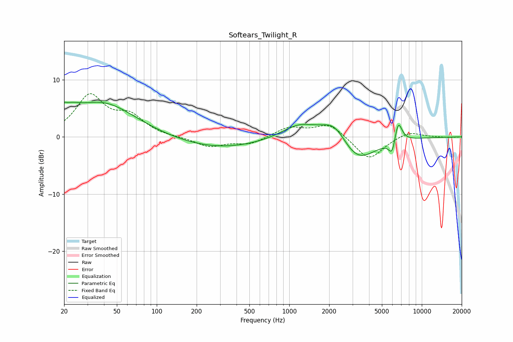

# Softears_Twilight_R
See [usage instructions](https://github.com/jaakkopasanen/AutoEq#usage) for more options and info.

### Parametric EQs
Apply preamp of -6.2 dB when using parametric equalizer.

|   # | Type    |   Fc (Hz) |    Q |   Gain (dB) |
|-----|---------|-----------|------|-------------|
|   1 | Peaking |        20 | 5.33 |         3.4 |
|   2 | Peaking |        21 | 5.99 |        -2.2 |
|   3 | Peaking |        22 | 1.93 |         1.5 |
|   4 | Peaking |        39 | 0.58 |         5.9 |
|   5 | Peaking |       297 | 0.43 |        -2   |
|   6 | Peaking |      1196 | 1.04 |         2.5 |
|   7 | Peaking |      2205 | 1.4  |         3.9 |
|   8 | Peaking |      3189 | 1.01 |        -5   |
|   9 | Peaking |      5987 | 5.27 |        -2.9 |
|  10 | Peaking |      6626 | 4.64 |         4   |

### Fixed Band EQs
When using fixed band (also called graphic) equalizer, apply preamp of **-7.6 dB** (if available) and set gains manually with these parameters.

|   # | Type    |   Fc (Hz) |    Q |   Gain (dB) |
|-----|---------|-----------|------|-------------|
|   1 | Peaking |        31 | 1.41 |         7   |
|   2 | Peaking |        62 | 1.41 |         3.2 |
|   3 | Peaking |       125 | 1.41 |        -0.1 |
|   4 | Peaking |       250 | 1.41 |        -1.7 |
|   5 | Peaking |       500 | 1.41 |        -1.2 |
|   6 | Peaking |      1000 | 1.41 |         1.7 |
|   7 | Peaking |      2000 | 1.41 |         2.3 |
|   8 | Peaking |      4000 | 1.41 |        -4.1 |
|   9 | Peaking |      8000 | 1.41 |         1.1 |
|  10 | Peaking |     16000 | 1.41 |        -0.1 |

### Graphs

