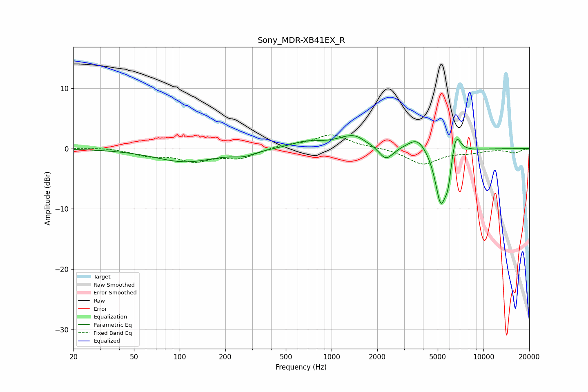

# Sony_MDR-XB41EX_R
See [usage instructions](https://github.com/jaakkopasanen/AutoEq#usage) for more options and info.

### Parametric EQs
Apply preamp of -2.2 dB when using parametric equalizer.

|   # | Type    |   Fc (Hz) |    Q |   Gain (dB) |
|-----|---------|-----------|------|-------------|
|   1 | Peaking |       109 | 0.7  |        -2.2 |
|   2 | Peaking |       265 | 2.09 |        -0.8 |
|   3 | Peaking |       672 | 1.4  |         1   |
|   4 | Peaking |      1488 | 1.28 |         2.8 |
|   5 | Peaking |      1675 | 2.39 |        -0.9 |
|   6 | Peaking |      2271 | 2.8  |        -2.6 |
|   7 | Peaking |      3684 | 2.29 |         2.2 |
|   8 | Peaking |      5231 | 3.6  |        -9.2 |
|   9 | Peaking |      5852 | 6    |        -3.9 |
|  10 | Peaking |      6565 | 4.32 |         4.3 |

### Fixed Band EQs
When using fixed band (also called graphic) equalizer, apply preamp of **-2.4 dB** (if available) and set gains manually with these parameters.

|   # | Type    |   Fc (Hz) |    Q |   Gain (dB) |
|-----|---------|-----------|------|-------------|
|   1 | Peaking |        31 | 1.41 |         0.2 |
|   2 | Peaking |        62 | 1.41 |        -1   |
|   3 | Peaking |       125 | 1.41 |        -1.9 |
|   4 | Peaking |       250 | 1.41 |        -1.5 |
|   5 | Peaking |       500 | 1.41 |         0.6 |
|   6 | Peaking |      1000 | 1.41 |         2.3 |
|   7 | Peaking |      2000 | 1.41 |         0.2 |
|   8 | Peaking |      4000 | 1.41 |        -2.6 |
|   9 | Peaking |      8000 | 1.41 |        -0.6 |
|  10 | Peaking |     16000 | 1.41 |        -0.7 |

### Graphs

