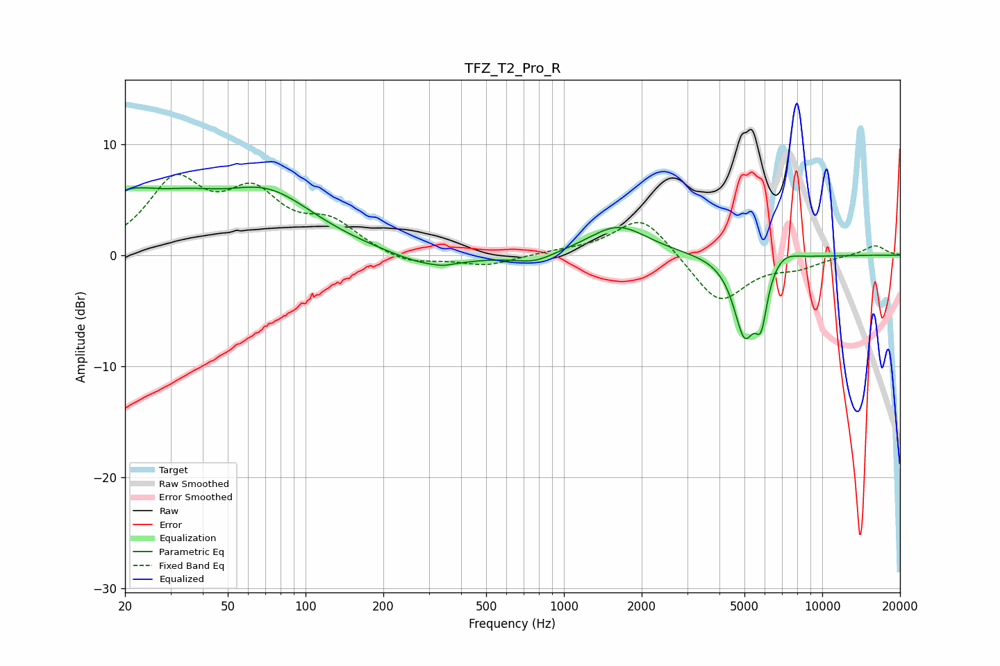

# TFZ_T2_Pro_R
See [usage instructions](https://github.com/jaakkopasanen/AutoEq#usage) for more options and info.

### Parametric EQs
Apply preamp of -6.2 dB when using parametric equalizer.

|   # | Type    |   Fc (Hz) |    Q |   Gain (dB) |
|-----|---------|-----------|------|-------------|
|   1 | Peaking |        20 | 0.96 |         4.4 |
|   2 | Peaking |        36 | 1.08 |         1.9 |
|   3 | Peaking |        71 | 0.75 |         5.1 |
|   4 | Peaking |       303 | 1.02 |        -1.3 |
|   5 | Peaking |       341 | 5.9  |        -0.1 |
|   6 | Peaking |       765 | 1.8  |        -0.8 |
|   7 | Peaking |      1620 | 1.24 |         2.7 |
|   8 | Peaking |      5005 | 3.24 |        -7   |
|   9 | Peaking |      5803 | 5.99 |        -4.2 |
|  10 | Peaking |      7070 | 2.56 |         0.9 |

### Fixed Band EQs
When using fixed band (also called graphic) equalizer, apply preamp of **-7.4 dB** (if available) and set gains manually with these parameters.

|   # | Type    |   Fc (Hz) |    Q |   Gain (dB) |
|-----|---------|-----------|------|-------------|
|   1 | Peaking |        31 | 1.41 |         6.2 |
|   2 | Peaking |        62 | 1.41 |         4.8 |
|   3 | Peaking |       125 | 1.41 |         2.6 |
|   4 | Peaking |       250 | 1.41 |        -0.9 |
|   5 | Peaking |       500 | 1.41 |        -1   |
|   6 | Peaking |      1000 | 1.41 |         0.3 |
|   7 | Peaking |      2000 | 1.41 |         3.7 |
|   8 | Peaking |      4000 | 1.41 |        -4.4 |
|   9 | Peaking |      8000 | 1.41 |        -0.9 |
|  10 | Peaking |     16000 | 1.41 |         0.9 |

### Graphs

