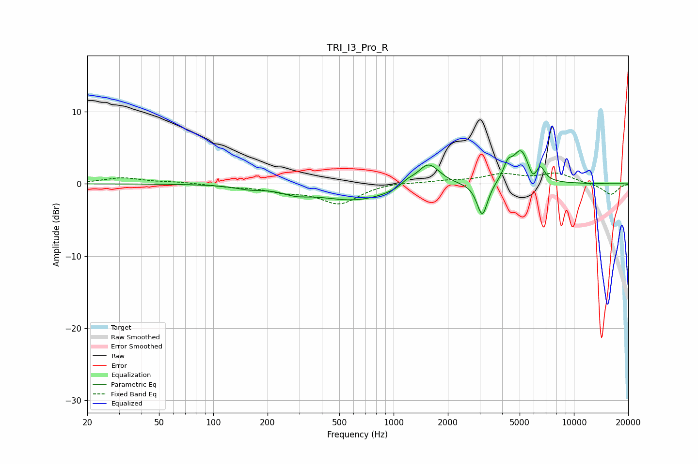

# TRI_I3_Pro_R
See [usage instructions](https://github.com/jaakkopasanen/AutoEq#usage) for more options and info.

### Parametric EQs
Apply preamp of -4.7 dB when using parametric equalizer.

|   # | Type    |   Fc (Hz) |    Q |   Gain (dB) |
|-----|---------|-----------|------|-------------|
|   1 | Peaking |       158 | 1.89 |        -0.4 |
|   2 | Peaking |       286 | 1.96 |        -0.7 |
|   3 | Peaking |       615 | 0.67 |        -2.3 |
|   4 | Peaking |      1196 | 3.97 |         0.6 |
|   5 | Peaking |      1559 | 2.26 |         3.3 |
|   6 | Peaking |      3103 | 4.76 |        -4.7 |
|   7 | Peaking |      4297 | 5.9  |         1.9 |
|   8 | Peaking |      5086 | 3.06 |         4.6 |
|   9 | Peaking |      5906 | 6    |        -1.4 |
|  10 | Peaking |      6528 | 6    |         1.7 |

### Fixed Band EQs
When using fixed band (also called graphic) equalizer, apply preamp of **-1.6 dB** (if available) and set gains manually with these parameters.

|   # | Type    |   Fc (Hz) |    Q |   Gain (dB) |
|-----|---------|-----------|------|-------------|
|   1 | Peaking |        31 | 1.41 |         0.8 |
|   2 | Peaking |        62 | 1.41 |         0.2 |
|   3 | Peaking |       125 | 1.41 |        -0.3 |
|   4 | Peaking |       250 | 1.41 |        -0.9 |
|   5 | Peaking |       500 | 1.41 |        -2.7 |
|   6 | Peaking |      1000 | 1.41 |         0.3 |
|   7 | Peaking |      2000 | 1.41 |         0.4 |
|   8 | Peaking |      4000 | 1.41 |         1.2 |
|   9 | Peaking |      8000 | 1.41 |         1.4 |
|  10 | Peaking |     16000 | 1.41 |        -1.5 |

### Graphs

