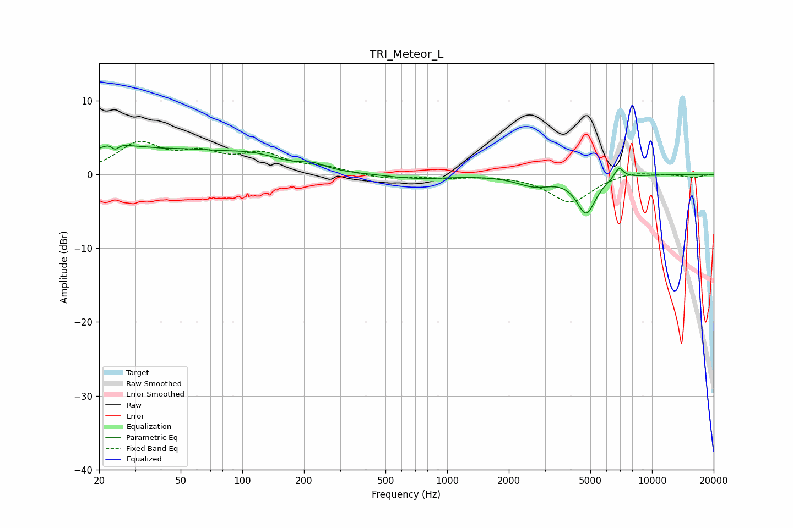

# TRI_Meteor_L
See [usage instructions](https://github.com/jaakkopasanen/AutoEq#usage) for more options and info.

### Parametric EQs
Apply preamp of -4.0 dB when using parametric equalizer.

|   # | Type    |   Fc (Hz) |    Q |   Gain (dB) |
|-----|---------|-----------|------|-------------|
|   1 | Peaking |        24 | 4.67 |         3.3 |
|   2 | Peaking |        24 | 5.95 |        -3.4 |
|   3 | Peaking |        33 | 0.37 |         3.7 |
|   4 | Peaking |        40 | 1.61 |        -0.3 |
|   5 | Peaking |       114 | 1.03 |         1.4 |
|   6 | Peaking |       222 | 2.46 |         0.7 |
|   7 | Peaking |       715 | 0.93 |        -0.6 |
|   8 | Peaking |      2656 | 1.64 |        -1.4 |
|   9 | Peaking |      4768 | 3    |        -5.1 |
|  10 | Peaking |      6890 | 6    |         1.6 |

### Fixed Band EQs
When using fixed band (also called graphic) equalizer, apply preamp of **-4.6 dB** (if available) and set gains manually with these parameters.

|   # | Type    |   Fc (Hz) |    Q |   Gain (dB) |
|-----|---------|-----------|------|-------------|
|   1 | Peaking |        31 | 1.41 |         3.9 |
|   2 | Peaking |        62 | 1.41 |         2.3 |
|   3 | Peaking |       125 | 1.41 |         2.4 |
|   4 | Peaking |       250 | 1.41 |         0.8 |
|   5 | Peaking |       500 | 1.41 |        -0.6 |
|   6 | Peaking |      1000 | 1.41 |        -0.4 |
|   7 | Peaking |      2000 | 1.41 |        -0   |
|   8 | Peaking |      4000 | 1.41 |        -3.8 |
|   9 | Peaking |      8000 | 1.41 |         0.6 |
|  10 | Peaking |     16000 | 1.41 |        -0.4 |

### Graphs

