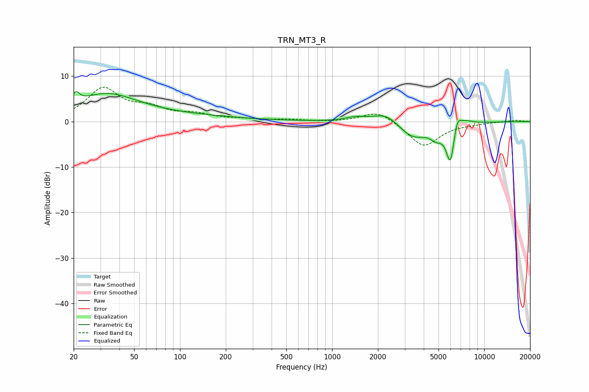

# TRN_MT3_R
See [usage instructions](https://github.com/jaakkopasanen/AutoEq#usage) for more options and info.

### Parametric EQs
Apply preamp of -6.7 dB when using parametric equalizer.

|   # | Type    |   Fc (Hz) |    Q |   Gain (dB) |
|-----|---------|-----------|------|-------------|
|   1 | Peaking |        21 | 5.84 |         2.3 |
|   2 | Peaking |        32 | 0.69 |         5.3 |
|   3 | Peaking |        82 | 0.31 |         1.2 |
|   4 | Peaking |      1428 | 2.23 |         0.8 |
|   5 | Peaking |      2297 | 1.56 |         2.7 |
|   6 | Peaking |      3354 | 1.36 |        -3.9 |
|   7 | Peaking |      4835 | 3.49 |        -2   |
|   8 | Peaking |      5989 | 4.87 |        -8.7 |
|   9 | Peaking |      6632 | 5.53 |         3.4 |
|  10 | Peaking |      7483 | 2.73 |         1   |

### Fixed Band EQs
When using fixed band (also called graphic) equalizer, apply preamp of **-7.7 dB** (if available) and set gains manually with these parameters.

|   # | Type    |   Fc (Hz) |    Q |   Gain (dB) |
|-----|---------|-----------|------|-------------|
|   1 | Peaking |        31 | 1.41 |         7   |
|   2 | Peaking |        62 | 1.41 |         2.4 |
|   3 | Peaking |       125 | 1.41 |         1.3 |
|   4 | Peaking |       250 | 1.41 |         0.4 |
|   5 | Peaking |       500 | 1.41 |         0.4 |
|   6 | Peaking |      1000 | 1.41 |        -0.1 |
|   7 | Peaking |      2000 | 1.41 |         2.6 |
|   8 | Peaking |      4000 | 1.41 |        -5.6 |
|   9 | Peaking |      8000 | 1.41 |        -0.3 |
|  10 | Peaking |     16000 | 1.41 |         0.3 |

### Graphs

