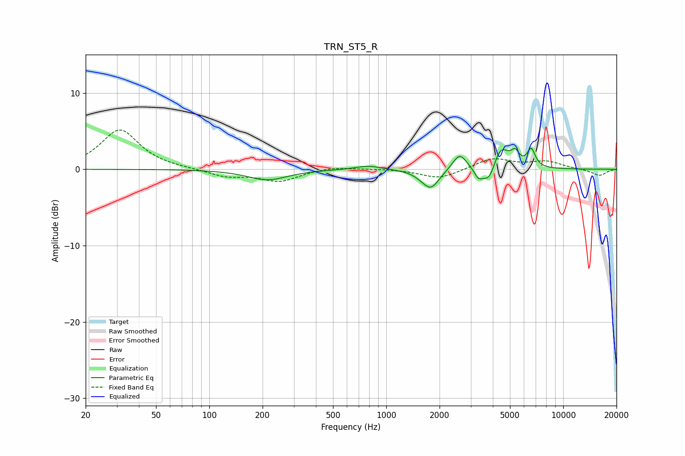

# TRN_ST5_R
See [usage instructions](https://github.com/jaakkopasanen/AutoEq#usage) for more options and info.

### Parametric EQs
Apply preamp of -2.8 dB when using parametric equalizer.

|   # | Type    |   Fc (Hz) |    Q |   Gain (dB) |
|-----|---------|-----------|------|-------------|
|   1 | Peaking |       213 | 1.25 |        -1.4 |
|   2 | Peaking |       791 | 1.91 |         0.5 |
|   3 | Peaking |      1638 | 2.53 |        -0.4 |
|   4 | Peaking |      1790 | 2.95 |        -2.3 |
|   5 | Peaking |      2597 | 3.55 |         2.2 |
|   6 | Peaking |      3317 | 6    |        -1.2 |
|   7 | Peaking |      3815 | 3.93 |        -2.4 |
|   8 | Peaking |      4427 | 3.14 |         3.1 |
|   9 | Peaking |      5355 | 6    |         1.6 |
|  10 | Peaking |      6594 | 6    |         2.3 |

### Fixed Band EQs
When using fixed band (also called graphic) equalizer, apply preamp of **-5.2 dB** (if available) and set gains manually with these parameters.

|   # | Type    |   Fc (Hz) |    Q |   Gain (dB) |
|-----|---------|-----------|------|-------------|
|   1 | Peaking |        31 | 1.41 |         5.2 |
|   2 | Peaking |        62 | 1.41 |         0.1 |
|   3 | Peaking |       125 | 1.41 |        -0.9 |
|   4 | Peaking |       250 | 1.41 |        -1.5 |
|   5 | Peaking |       500 | 1.41 |         0.4 |
|   6 | Peaking |      1000 | 1.41 |         0.1 |
|   7 | Peaking |      2000 | 1.41 |        -1.3 |
|   8 | Peaking |      4000 | 1.41 |         1.4 |
|   9 | Peaking |      8000 | 1.41 |         1   |
|  10 | Peaking |     16000 | 1.41 |        -0.8 |

### Graphs

